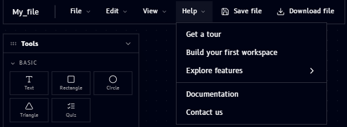

# Help

The **Help** menu sits in the top bar, in the row of File / Edit / View menus, right after **View**. Clicking it opens a dropdown that's your entry point to onboarding and support resources:

| Item | What it does |
|---|---|
| Get a tour | Launches a guided walkthrough of the Qanvas interface |
| Build your first workspace | A guided tutorial for creating your first workspace |
| Explore features | Opens a submenu linking to feature-specific guides |
| Documentation | Opens this documentation site |
| Contact us | Reach out to the Qucan team for support |
