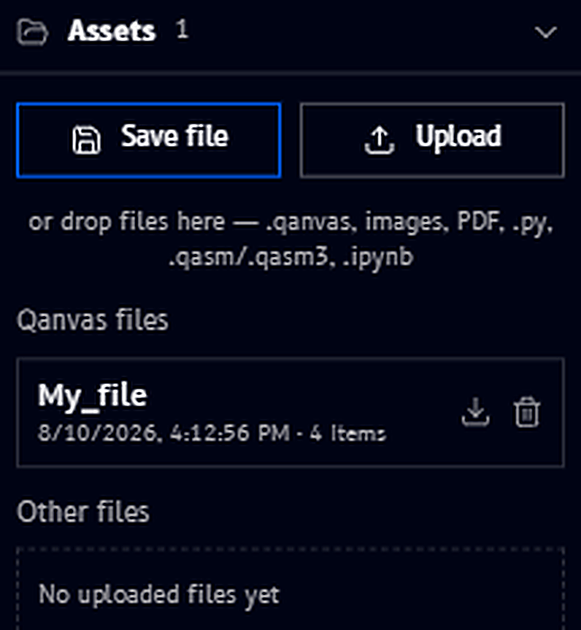

# Assets

**Assets** is the last collapsible section in the [Tools panel](tools.md), below [Ready circuits](ready-circuits.md). It's where this workspace's saved files live, and where you bring outside files in, with a count next to the section title showing how many it holds:

{ .doc-image--portrait }

## Save file and Upload

Two buttons sit at the top of the panel:

- **Save file** - saves the current workspace (same action as [Save file in the top bar](customizing.md))
- **Upload** - opens a file picker to bring a file in, the same as dragging one onto the canvas

Below them, you can also **drop files directly** onto the panel. The supported types are listed right there: `.qanvas`, images, PDF, `.py`, `.qasm`/`.qasm3`, and `.ipynb` (Jupyter notebooks).

## Qanvas files

This lists other **.qanvas workspace files** you've saved, each with when it was last saved and how many items it contains, for example `My_file`, saved `8/10/2026, 4:12:56 PM`, with `4 items`. The download and trash icons next to an entry let you download or delete that saved workspace without having to open it first.

## Other files

This lists standalone files you've uploaded into **this** workspace, images, PDFs, Python scripts, OpenQASM files, and notebooks, so you can drag one onto the canvas again (as an [Upload block](upload-blocks.md)) without re-uploading it. It starts out empty, "No uploaded files yet", until you upload or drop something.
