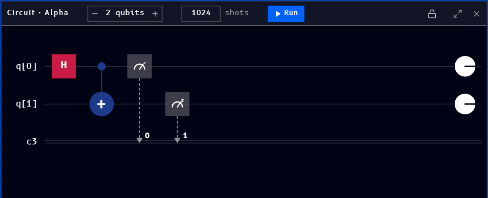
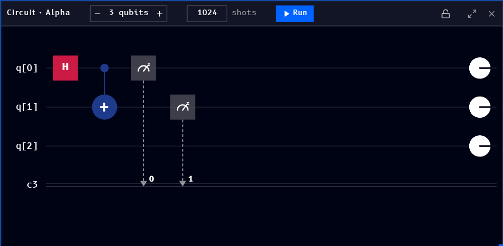
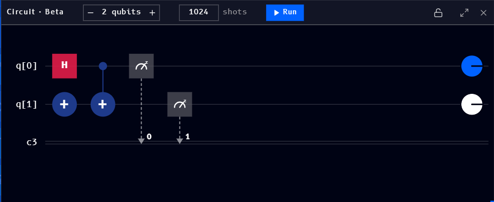

# Circuit

The **Circuit** block (found under [Quantum](tools.md#quantum) in the Tools panel) places a circuit-building item on the canvas, the Qanvas equivalent of the Circuit panel in [Qompile](../../qompile/tour/drag-drop/circuit.md). Like other blocks, it has a name (shown here as **"Circuit · Alpha"**), and lock, expand, and close controls in its header.

## Building a circuit

Place a Circuit block on the canvas, then drag gates from [Operations](operations-block.md) onto its qubit wires. Here's an `H` + `CNOT` + measurement circuit on two qubits:

A circuit can also arrive already built, for example by [converting an OpenQASM file](upload-blocks.md#converting-to-a-circuit) into a Circuit block.

## Qubits

Use the **-** / **+** stepper next to the qubit count to add or remove quantum registers. The same circuit with an extra, unused third qubit added:

Clicking **-** back down to 2 qubits removes the unused register and returns to the circuit shown above.

## Naming and multiple circuits

Each Circuit block gets its own name, shown at the left of its header (**"Circuit · Alpha"** above). A workspace isn't limited to one circuit: adding another Circuit block names it **Beta**, then **Gamma**, and so on, so you can build and compare several circuits side by side on the same canvas:

This naming is what the [Coding](coding-block.md), [Bloch sphere](bloch-sphere-block.md), [Q-Sphere](q-sphere-block.md), and [Results](results-block.md) blocks use to let you pick which circuit they're showing.

## Shots

The **shots** field (defaulting to `1024`) sets how many times the circuit runs when you click **Run**.

## Running

Click **Run** to execute the circuit for the given number of shots.
