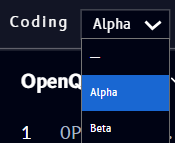

# Coding

The **Coding** block (found under [Quantum](tools.md#quantum) in the Tools panel) shows the code for a [Circuit](circuit-block.md) block on the same canvas, the Qanvas equivalent of the code panel in [Qompile](../../qompile/tour/code/openqasm.md). For what the code itself means, see Qompile's [Build with code](../../qompile/tour/code/openqasm.md) pages, the same OpenQASM, Qiskit, Cirq, and Q# output applies here.

## Choosing which circuit to show

Since a workspace can hold more than one [Circuit block](circuit-block.md#naming-and-multiple-circuits), the Coding block's header has a dropdown to pick which one it's currently displaying by name:

- **-** (a dash) - show no circuit
- Any named circuit on the canvas (**Alpha**, **Beta**, ...) - show that circuit's code

This same dropdown pattern, pick a circuit by name, appears again on the [Bloch sphere](bloch-sphere-block.md), [Q-Sphere](q-sphere-block.md), and [Results](results-block.md) blocks.
