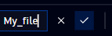
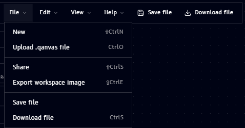
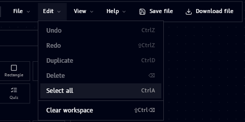
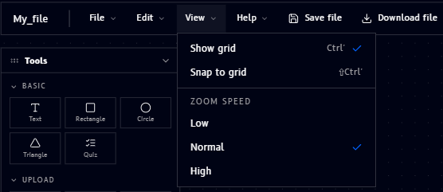

# Customizing your workspace

## Name

Hover over the workspace's name (shown as **"Untitled workspace"** by default, in the top bar) to reveal an edit icon:

Click the name (or the edit icon) to rename it. It becomes an editable text field with confirm and cancel controls:

- Type the new name, then either:
    - Click the **checkmark** (or press **Enter**) to confirm the new name
    - Click the **X** (or press **Escape**) to cancel and keep the previous name

## File / Edit / View dropdowns

Three menus in the top bar give you file management, editing, and view controls. A fourth, **Help**, is covered separately on the [Help](../help.md) page.

### File

| Item | Shortcut | What it does |
|---|---|---|
| New | ⇧Ctrl N | Start a new, blank workspace |
| Upload .qanvas file | Ctrl O | Import a workspace from a `.qanvas` file |
| Share | ⇧Ctrl S | Share the workspace with others |
| Export workspace image | ⇧Ctrl E | Save the canvas as an image |
| Save file | - | Save the workspace |
| Download file | Ctrl S | Download the workspace file |

!!! note
    Saving a workspace shows a confirmation toast and adds it to **Assets**:

    

    See [Assets](tools.md#assets) for where saved files show up afterward.

### Edit

| Item | Shortcut | What it does |
|---|---|---|
| Undo | Ctrl Z | Undo the last action |
| Redo | ⇧Ctrl Z | Redo the last undone action |
| Duplicate | Ctrl D | Duplicate the selected item(s) |
| Delete | ⌫ | Delete the selected item(s) |
| Select all | Ctrl A | Select every item on the canvas |
| Clear workspace | ⇧Ctrl ⌫ | Remove everything from the canvas |

### View

- **Show grid** (Ctrl `'`) - toggle the dotted background grid on/off
- **Snap to grid** (⇧Ctrl `'`) - snap items to the grid as you move them
- **Zoom speed** - set scroll-to-zoom sensitivity to **Low**, **Normal**, or **High**
