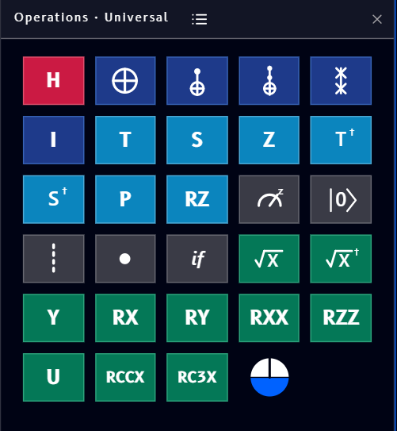

# Operations

The **Operations** block (found under [Quantum](tools.md#quantum) in the Tools panel) is a gate catalog you can place on the canvas, the Qanvas equivalent of the Operations panel in [Qompile](../../qompile/tour/drag-drop/operations.md):

{ .doc-image--portrait }

To use it, first place a [Circuit](circuit-block.md) block on the canvas, then drag gates from Operations onto a wire on that Circuit block to place them, the same drag-and-drop motion used in Qompile. Not sure what a gate actually does? Every gate has its own page in the [Gate reference](../../qompile/gates/index.md).

