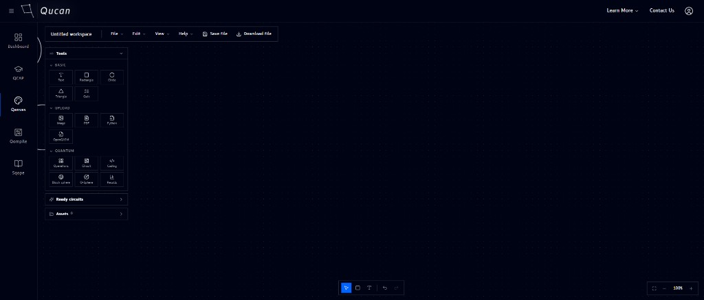

# Tour of Qanvas

When you open Qanvas, you land on an empty workspace. The interface is split into a few main regions:

| # | Region | What it's for |
|---|--------|----------------|
| 1 | **Top bar** | Workspace name, File / Edit / View / Help menus, and **Save file** / **Download file** buttons |
| 2 | **Module sidebar** (far left) | Switch between Dashboard, QCAP, Qanvas, Qompile, and Sqope |
| 3 | **Tools panel** | Browse and drag basic shapes, uploads, and quantum blocks onto the canvas |
| 4 | **[Ready circuits](ready-circuits.md)** | A library of prebuilt circuits you can drop onto the canvas |
| 5 | **[Assets](assets.md)** | Files you've uploaded into this workspace |
| 6 | **Canvas** (center) | The infinite workspace where everything you place gets arranged |
| 7 | **Zoom controls** (bottom right) | Fit to screen, zoom out, current zoom level, zoom in |

The next sections walk through each of these in depth, starting with the [Tools panel](tools.md).
