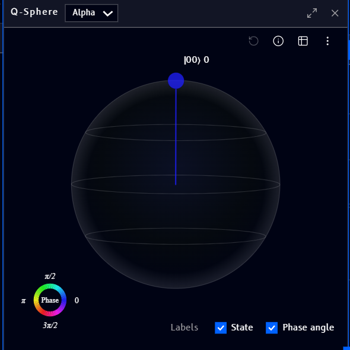

# Q-Sphere

The **Q-Sphere** block (found under [Quantum](tools.md#quantum) in the Tools panel) renders a circuit's full quantum state as points on a 3D sphere, the Qanvas equivalent of the Q-Sphere panel in [Qompile](../../qompile/tour/visualizations/q-sphere.md). It uses the same circuit-selector dropdown described on the [Coding](coding-block.md#choosing-which-circuit-to-show) page, pick a circuit by name to show its state here:

!!! note
    The exact state shown above is just an illustration of the UI, not a worked example, don't read it as a specific claim about what any particular circuit produces.

For how to read the sphere, the points, the Phase color wheel, the info tooltip, table view, and the Labels/options menu, all work the same way as Qompile's [Q-Sphere](../../qompile/tour/visualizations/q-sphere.md) panel.
