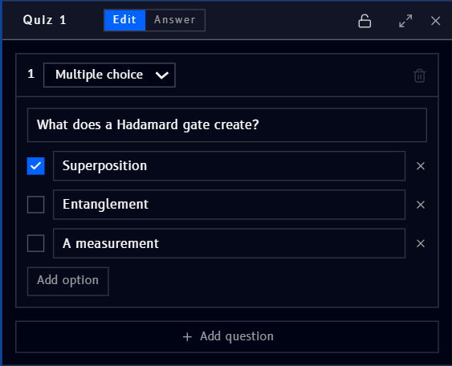
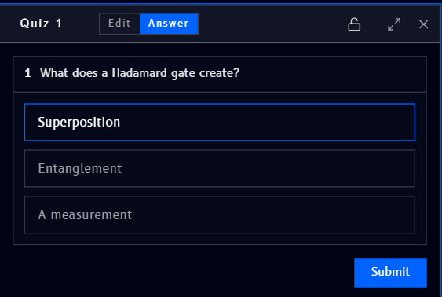

# Quiz

**Quiz** (found under [Basic](tools.md#basic) in the Tools panel) places an embeddable multiple-choice question block on the canvas, useful for turning a workspace into a short self-check alongside your circuits and notes.

## Editing a quiz

A new quiz opens in **Edit** mode, where you write the question:

- **Multiple choice** - the question type (currently the only type shown)
- Type the question text into its own field
- Add and edit **options**, one per row, with an **X** to remove an option
- Check the box next to an option to mark it as the **correct answer**
- **Add option** adds another row
- **Add question** adds another question to the same quiz block
- The trash icon (top right of the question) deletes that question
- The lock, expand, and **X** icons (top right of the block) lock, expand, and close the quiz block

## Answering a quiz

Switching to **Answer** mode shows the quiz the way someone taking it would see it, options only, no correct-answer checkmark:

- Click an option to select it
- **Submit** checks the answer

## Example

The question shown above, **"What does a Hadamard gate create?"** with **Superposition** marked correct, is a natural companion to the [Hadamard (H)](../../qompile/gates/hadamard.md) gate reference page, a quick way to check understanding right next to a circuit that demonstrates it.
