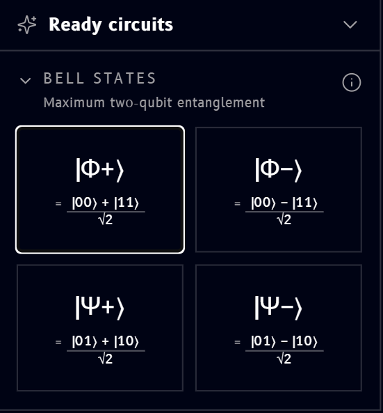
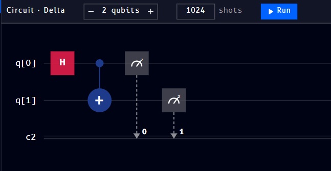
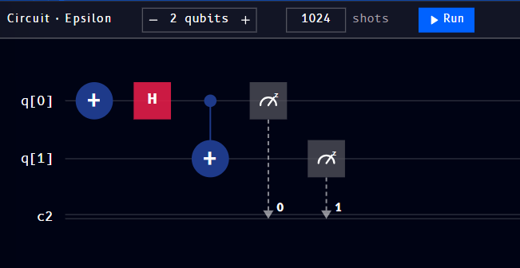
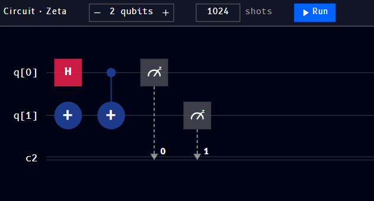
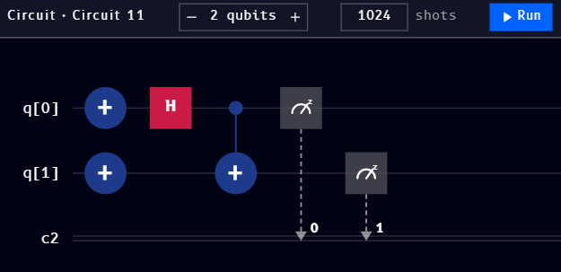

# Ready circuits

**Ready circuits** is its own collapsible section in the [Tools panel](tools.md), below the Tools categories. It's a library of prebuilt circuits, grouped by category, that you can drop directly onto the canvas as a fully-formed [Circuit block](circuit-block.md) instead of building them gate by gate.

## Bell states

The first category is **Bell states**, [entangled two-qubit states](../../qompile/algorithms/bell-states.md) built from just a Hadamard and a CNOT. Clicking the **ⓘ** icon next to the category name explains the shared idea, "Maximum two-qubit entanglement", and four tiles show the four Bell states with their formulas:

- \( |\Phi^+\rangle = \dfrac{|00\rangle + |11\rangle}{\sqrt{2}} \)
- \( |\Phi^-\rangle = \dfrac{|00\rangle - |11\rangle}{\sqrt{2}} \)
- \( |\Psi^+\rangle = \dfrac{|01\rangle + |10\rangle}{\sqrt{2}} \)
- \( |\Psi^-\rangle = \dfrac{|01\rangle - |10\rangle}{\sqrt{2}} \)

Although all four look similar on paper (each is an equal superposition of two basis states), clicking each tile drops a genuinely different circuit onto the canvas, an extra **X** gate or two before the usual H + CNOT, to steer the result to that specific Bell state:

=== "|Φ+⟩"

    

    Just **H** then **CNOT**, the base pattern.

=== "|Φ-⟩"

    

    An **X** on `q[0]` before the H flips the relative sign, `+` becomes `-`.

=== "|Ψ+⟩"

    

    An **X** on `q[1]` before the H + CNOT swaps which pair of outcomes gets correlated, `00`/`11` becomes `01`/`10`.

=== "|Ψ-⟩"

    

    An **X** on both `q[0]` and `q[1]` combines both effects at once.

!!! note
    The block names above (`Delta`, `Epsilon`, ...) are just this workspace's auto-generated names at the time these were captured, see [naming multiple circuits](circuit-block.md#naming-and-multiple-circuits). Yours may come out named differently depending on what's already on your canvas.

Once dropped onto the canvas, a ready circuit is a normal, fully editable [Circuit block](circuit-block.md), drag more gates from [Operations](operations-block.md) onto it, add qubits, or change the shot count, exactly as you would with one you built from scratch.
