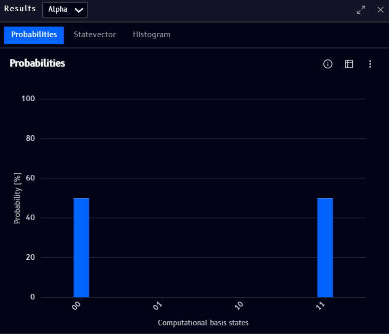

# Results

The **Results** block (found under [Quantum](tools.md#quantum) in the Tools panel) shows a circuit's measurement outcomes, the Qanvas equivalent of Qompile's [Probabilities](../../qompile/tour/visualizations/probabilities.md) and [Statevector](../../qompile/tour/visualizations/statevector.md) panels combined into one block. It uses the same circuit-selector dropdown described on the [Coding](coding-block.md#choosing-which-circuit-to-show) page, pick a circuit by name to show its results here.

## Tabs

Three tabs across the top switch between views of the same run:

- **Probabilities** - a bar chart of measurement outcome probabilities, one bar per computational basis state, shown above
- **Statevector** - the exact complex amplitudes behind those probabilities, see Qompile's [Statevector](../../qompile/tour/visualizations/statevector.md) page for how to read it
- **Histogram** - shot-by-shot outcome counts from running the circuit

!!! note
    The exact values shown above are just an illustration of the UI, not a worked example, don't read them as a specific claim about what any particular circuit produces.

For the info tooltip, table view, and options menu (download, hide zeros, etc.), these work the same way as Qompile's [Probabilities](../../qompile/tour/visualizations/probabilities.md) panel.
