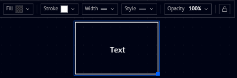
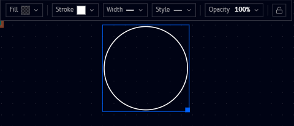
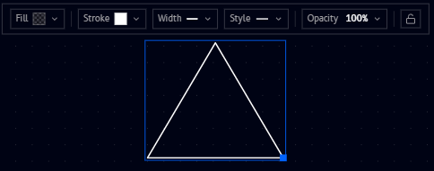
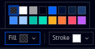
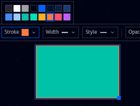
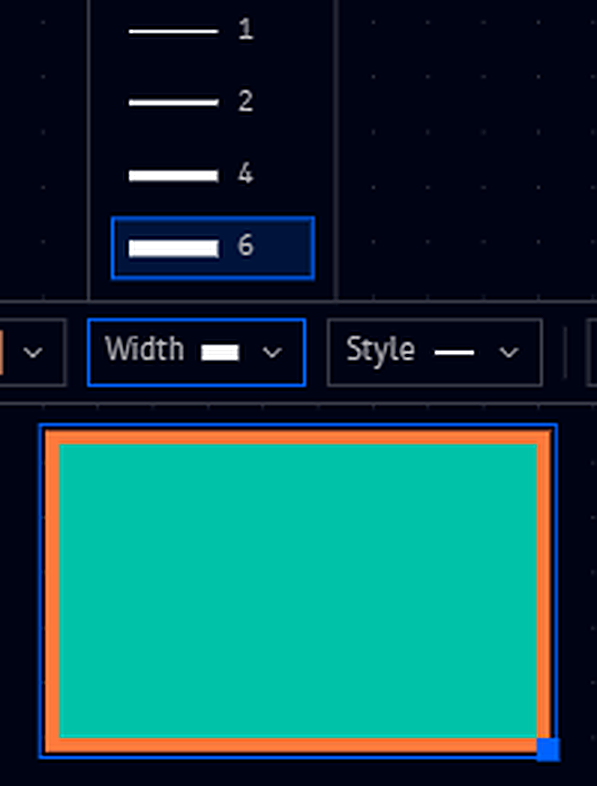
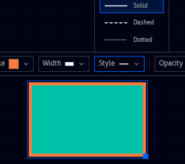
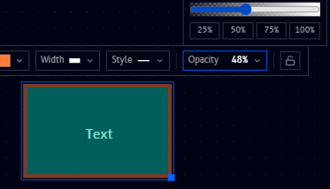

# Shapes

**Rectangle**, **Circle**, and **Triangle** (found under [Basic](tools.md#basic) in the Tools panel) place a basic shape on the canvas. All three share the same floating toolbar, shown here on a selected **Rectangle**:

The same toolbar on a **Circle** and a **Triangle**:

=== "Circle"

    

=== "Triangle"

    

From left to right, the toolbar offers:

| Icon | What it does |
|---|---|
| **Fill** | Set the shape's fill (background) color, or leave it transparent |
| **Stroke** | Set the shape's outline color |
| **Width** | Set the outline's line width |
| **Style** | Set the outline's line style (solid, dashed, ...) |
| **Opacity** | Set the shape's overall opacity, from 0 to 100% |
| Lock icon | Lock the shape in place on the canvas |

## Fill and stroke

**Fill** sets the shape's background color (or the checkerboard pattern shown for no fill/transparent), and **Stroke** sets its outline color. Both open the same palette of preset colors:

A teal fill with an orange stroke:

## Width

**Width** sets the outline's thickness, with presets of **1**, **2**, **4**, and **6**:

{ .doc-image--portrait }

## Style

**Style** sets the outline's line pattern: **Solid**, **Dashed**, or **Dotted**:

## Opacity

**Opacity** fades the whole shape (fill, stroke, and label together), from **0** to **100%**, with quick presets at 25/50/75/100% or a draggable slider for any value in between:

## Adding a label

Typing while a shape is selected adds a text label centered inside it (shown as **"Text"** above), styled using the same options as a standalone [Text](text-tool.md) box.

## Resizing

A selected shape shows a small handle at its corner (the blue dot in the screenshots above). Drag it to resize the shape, keeping the label centered inside as it grows or shrinks.
