# Text

**Text** (found under [Basic](tools.md#basic) in the Tools panel) places an editable text box on the canvas. Selecting it and clicking (or dragging) onto the canvas creates a text box with a floating formatting toolbar above it:

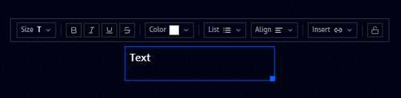

From left to right, the toolbar offers:

| Icon | What it does |
|---|---|
| **Size** | Choose a heading level or body/small text size |
| **B / I / U / S** | Bold, Italic, Underline, Strikethrough |
| **Color** | Set the text color |
| **List** | Turn the paragraph into a bullet or ordered list |
| **Align** | Left, center, or right align the text |
| **Insert** | Insert a link or a LaTeX equation |
| Lock icon | Lock the text box in place on the canvas |

## Size

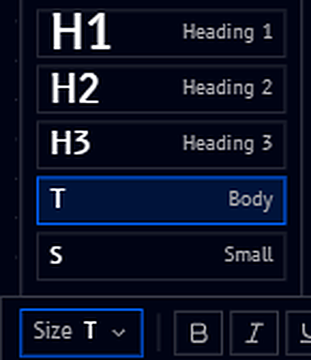{ .doc-image--portrait }

Five presets are available:

- **H1**, **H2**, **H3** - heading levels, largest to smallest
- **T Body** - the default paragraph size
- **S Small** - a smaller, secondary text size

## Color

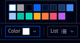

Pick from a palette of preset colors, including plain white, to make specific text (or a whole list) stand out.

## List

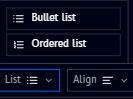

Turn the current paragraph into a **Bullet list** or an **Ordered list**. Pressing Enter continues the list on a new line, so you can keep adding items without reselecting the option:

=== "Bullet list"

    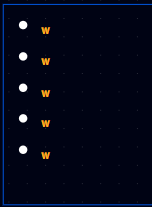

=== "Ordered list"

    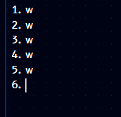

## Align

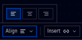

Align the text box's content **left** (the default, shown in the toolbar screenshot above), **center**, or **right**:

=== "Center align"

    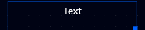

=== "Right align"

    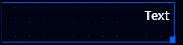

## Insert

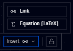

- **Link** - insert a hyperlink
- **Equation (LaTeX)** - insert a mathematical equation written in LaTeX, useful for annotating a circuit with the math behind it directly on the canvas

## Example

Combining color with the Size and other options lets you build annotated, styled notes right next to your circuits and code:

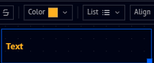
