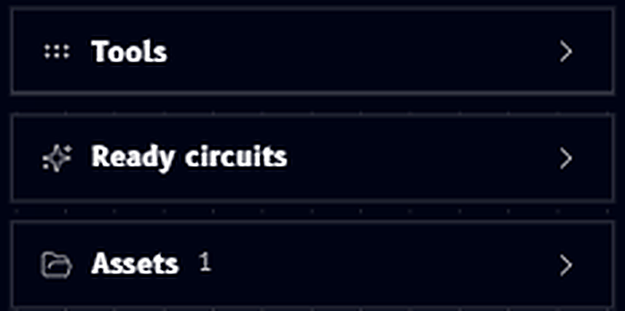
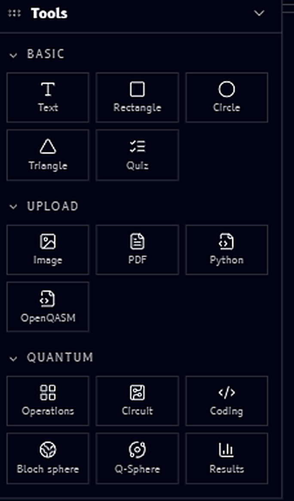

# Tools panel

The **Tools panel** sits on the left side of the canvas and holds everything you can drag onto your workspace, grouped into three collapsible sections: **Tools**, **Ready circuits**, and **Assets**:

{ .doc-image--compact }

Expanding **Tools** reveals three categories, **Basic**, **Upload**, and **Quantum**:

{ .doc-image--portrait }

## Basic

Simple shapes and text for sketching layouts or annotating a canvas:

- **Text** - a text label with its own rich formatting toolbar, see [Text](text-tool.md)
- **Rectangle**, **Circle**, **Triangle** - basic shapes with a fill/stroke/opacity toolbar, see [Shapes](shapes-tool.md)
- **Quiz** - an embeddable multiple-choice question block, see [Quiz](quiz-tool.md)

## Upload

Bring outside files onto the canvas, see [Upload blocks](upload-blocks.md):

- **Image** - image files
- **PDF** - PDF documents
- **Python** - Python scripts
- **OpenQASM** - OpenQASM files

## Quantum

The quantum-specific building blocks that make Qanvas more than a plain whiteboard:

- **Operations** - a gate catalog block, see [Operations](operations-block.md)
- **Circuit** - a circuit-building block with quantum and classical registers, see [Circuit](circuit-block.md)
- **Coding** - shows a circuit's code, see [Coding](coding-block.md)
- **Bloch sphere** - a per-qubit Bloch sphere visualization, see [Bloch sphere](bloch-sphere-block.md)
- **Q-Sphere** - a Q-Sphere visualization, see [Q-Sphere](q-sphere-block.md)
- **Results** - a results/output block, see [Results](results-block.md)

## Ready circuits

Below the Tools categories, **Ready circuits** is its own collapsible section holding a library of prebuilt circuits you can drop directly onto the canvas, see [Ready circuits](ready-circuits.md).

## Assets

**Assets** lists everything you've uploaded or saved into the current workspace, with a count next to the section title, so you can reuse a file you've already added without uploading it again, see [Assets](assets.md).
