# Upload blocks

Four block types under [Upload](tools.md#upload) bring outside files onto the canvas: **Image**, **PDF**, **Python**, and **OpenQASM**. Each starts as an empty drop zone you drop a file onto (or, for Python and OpenQASM, write directly), and can be expanded to a fullscreen view.

## Image

An empty **Image** block prompts you to drop or choose a file:

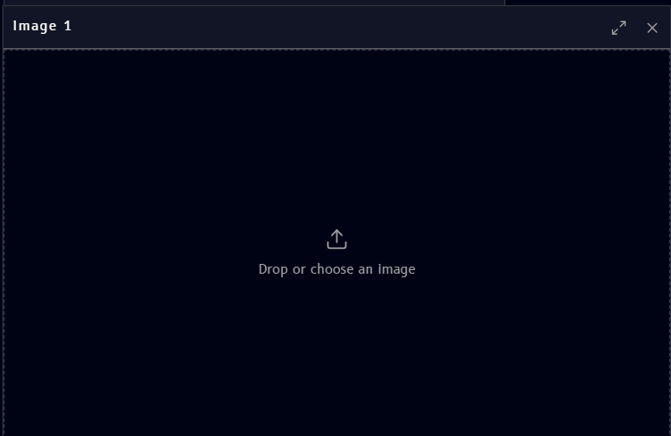

Once uploaded, the image renders directly in the block:

{ .doc-image--portrait }

Click the expand icon (top right of the block) to view the image fullscreen:

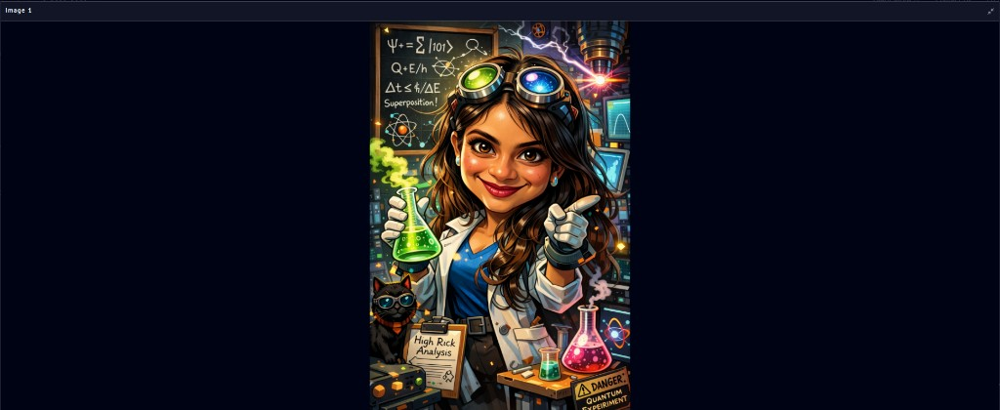

## PDF

A **PDF** block shows the document in a paginated viewer, with arrows on either side to move between pages:

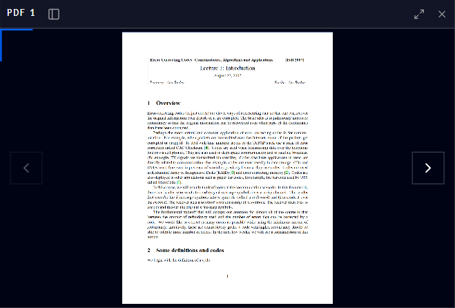

Click the expand icon (top left of the block) to view the PDF fullscreen, with the same page navigation:

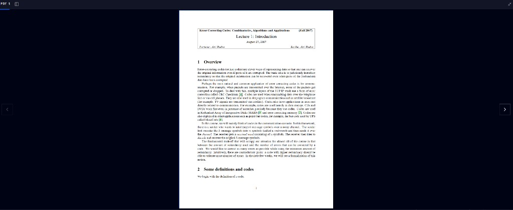

## Python

An empty **Python** block lets you either upload an existing `.py` file, or click **Create a new Python file** to start writing one directly on the canvas:

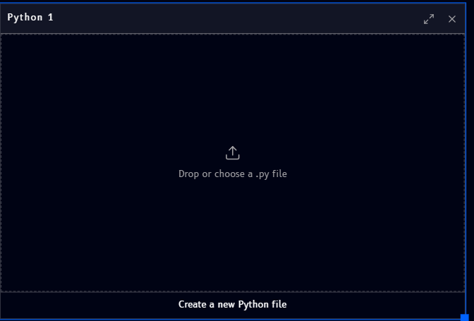

Once it has code, the block's header shows a filename, a **Run** button, and a **Download** icon, with an **Output** panel underneath:

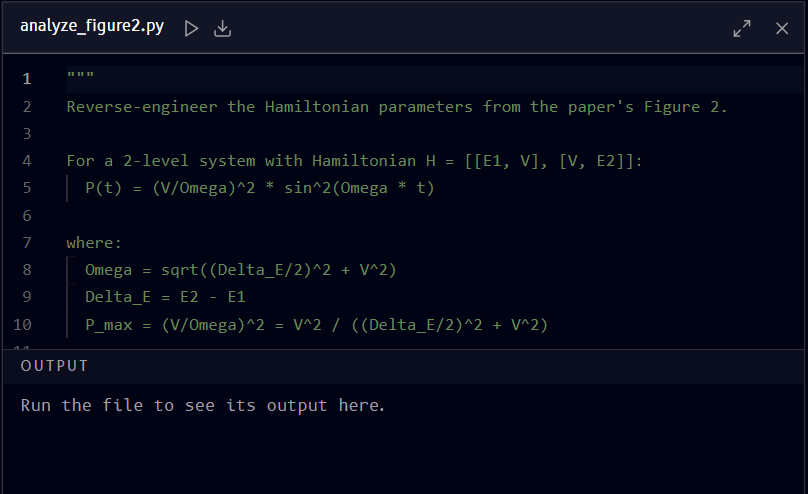

Clicking **Run** shows a spinner while the code executes:

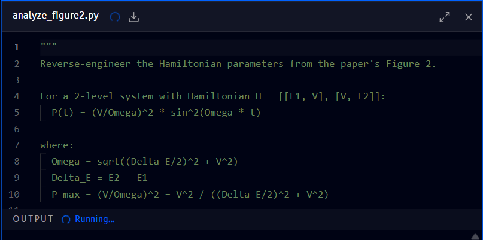

Once it finishes, **Output** fills in with whatever the script printed:

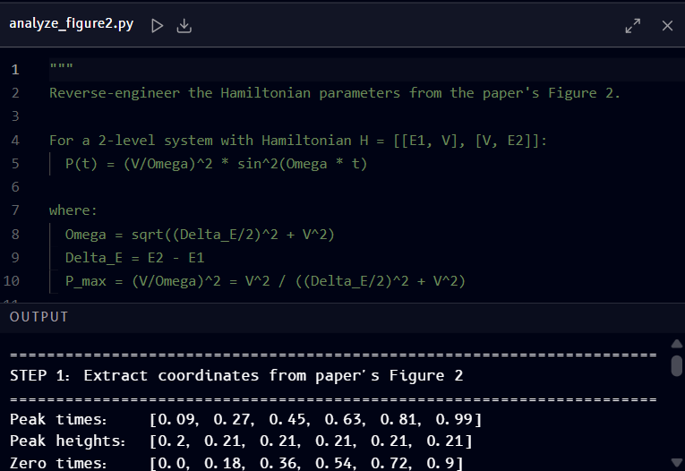

### Renaming

Click the filename to rename it, the same editable-field pattern used to rename the [workspace itself](customizing.md#name):

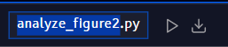

A Python block after being renamed:

### Downloading

Click the download icon in the header to download the block's code as a `.py` file.

## OpenQASM

An empty **OpenQASM file** block lets you either upload an existing `.qasm` file, or create a new one, choosing between **OpenQASM 2.0** and **3.0**:

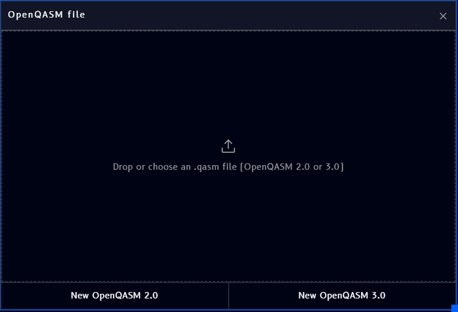

Creating a new file starts you off with a minimal Bell-state program, ready to edit, in the version you picked:

=== "OpenQASM 2.0"

    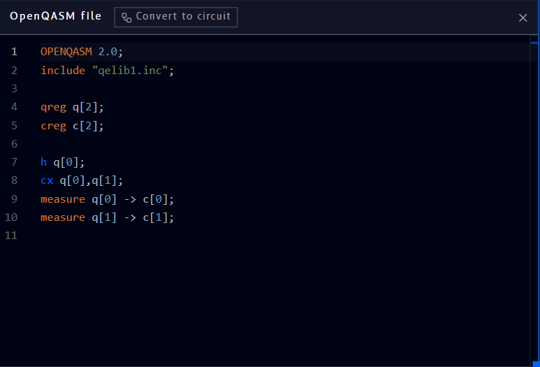

=== "OpenQASM 3.0"

    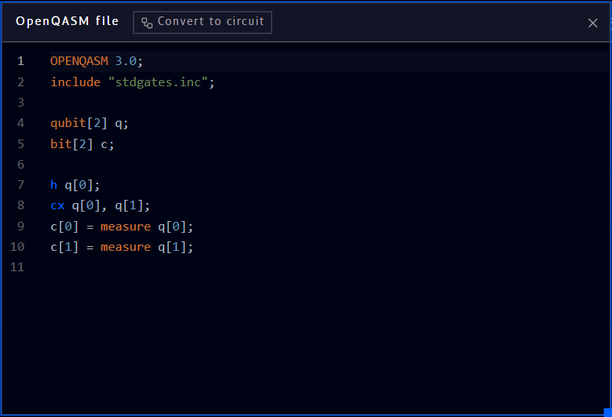

### Converting to a circuit

Click **Convert to circuit** (top of the block) to turn the code into an editable [Circuit](circuit-block.md) block on the same canvas:

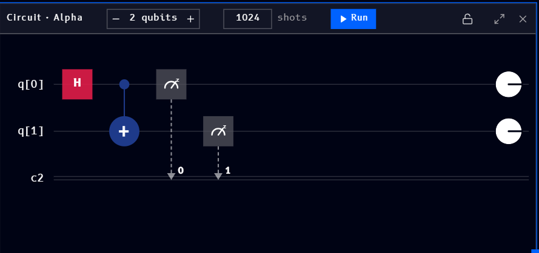
