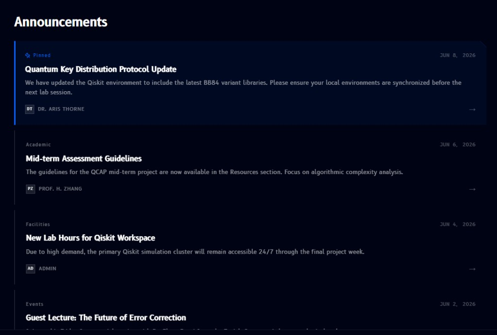

# Announcements

**Announcements**, found in the [sidebar](overview.md#sidebar) below the modules list, is a feed of updates from instructors and admins:

- A **Pinned** announcement (if any) always appears first, marked with a pin icon
- Every other announcement shows a small **category** label above its title (e.g. `Academic`, `Facilities`, `Events`)
- Each card has a **title**, a short body, the **date** it was posted (top right), and the **author**'s initials, avatar, and name (bottom left)
- The arrow on the right of a card opens the full announcement

!!! note
    The specific announcements shown above are just examples of what a card looks like, not current or fixed content.
