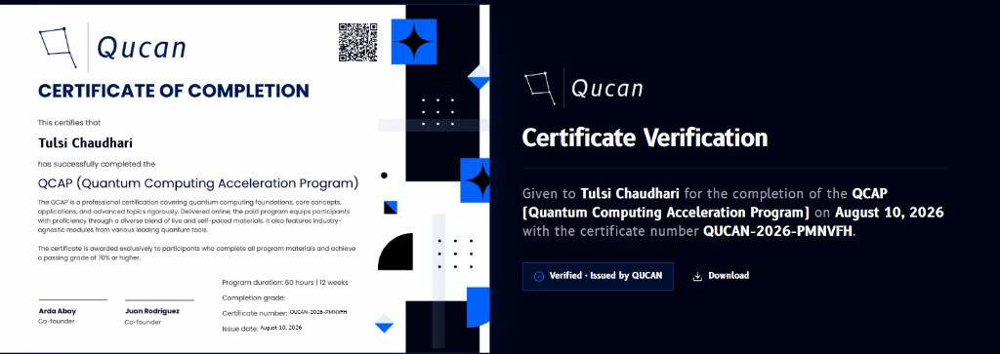

# Certificate

The **Certificate** card sits at the bottom of the [progress panel](overview.md#progress-panel), directly below "Track your progress."

- A lock icon and the card's title, **Certificate**, appear above a preview of the certificate itself
- While you haven't met the requirement, that preview is shown blurred out, so you can see roughly what a certificate looks like without being able to read or use it
- Underneath, a caption explains exactly what's needed: *"Complete all modules with an average grade of 70% or higher to unlock your certificate."*

## Unlocking it

The certificate is tied to your overall standing across the whole QCAP track, the same numbers summarized at the top of the progress panel:

- **All modules complete** - every module in the [sidebar](overview.md#sidebar) list, `History` through `Future`, needs to be finished, not just started
- **Average grade of 70% or higher** - based on the graded items shown on the [Grades](grades.md) page, weighted the same way as your overall grade there

Until both conditions are true, the card stays locked. Once they are, the blur lifts and the certificate becomes available.

## What you get

Once unlocked, the card lets you download an actual PDF, a **Certificate of Completion**, and gives anyone else a way to verify it:

- **Certificate of Completion** (left) - a Qucan-branded PDF certifying that you've completed the QCAP (Quantum Computing Acceleration Program), described on the certificate itself as a professional certification covering quantum computing foundations, core concepts, applications, and advanced topics, delivered online through a mix of live and self-paced material with industry-agnostic modules. It lists the **program duration** (60 hours, 12 weeks), your **completion grade**, a unique **certificate number** (formatted `QUCAN-<year>-<code>`, for example `QUCAN-2026-PMNVFH`), the **issue date**, and is signed by Qucan's co-founders, Arda Abay and Juan Rodriguez.
- A QR code printed on the PDF links straight to that certificate's **verification page**.
- **Certificate Verification** (right) - the page the QR code (or a direct link) opens. It repeats who the certificate was given to, the program, the completion date, and the certificate number, alongside a **Verified - Issued by QUCAN** badge and its own **Download** button to get the PDF again.

!!! note
    Because every certificate number is unique, the verification page also works as a way for someone else, an employer, for instance, to confirm a certificate is genuine without needing to log in to QCAP.
