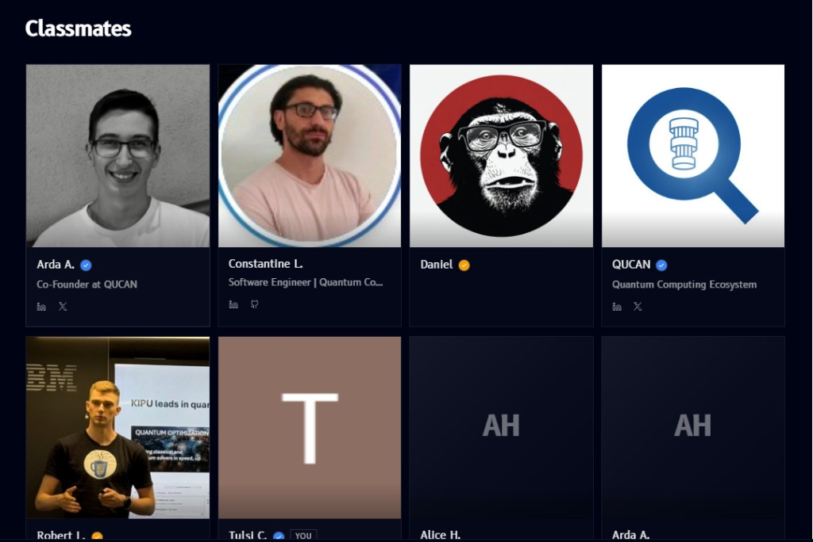

# Classmates

**Classmates**, found in the [sidebar](overview.md#sidebar) below the modules list, is a directory of everyone else taking the track with you:

- Each card shows a profile **photo or avatar**, a **name**, and a short **role or title**
- A checkmark badge next to a name marks a verified profile
- Social icons (e.g. LinkedIn, X) link out to that person's profile, when they've added one
- Your own card is labeled **YOU**, so you can spot yourself in the grid
