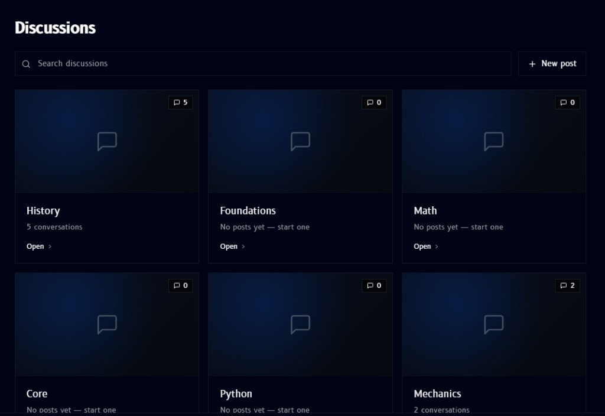

# Discussions Forum

**Discussions Forum**, found in the [sidebar](overview.md#sidebar) below the modules list, gives every module its own discussion board:

- **Search discussions** looks across every module's board at once
- **New post** starts a new discussion
- Each module gets its own card, showing how many conversations it has (e.g. `5 conversations`) or, if nobody's posted yet, `No posts yet - start one`
- **Open** jumps into that module's board

Boards fill in as people post, so most modules start out empty until a conversation gets going.
