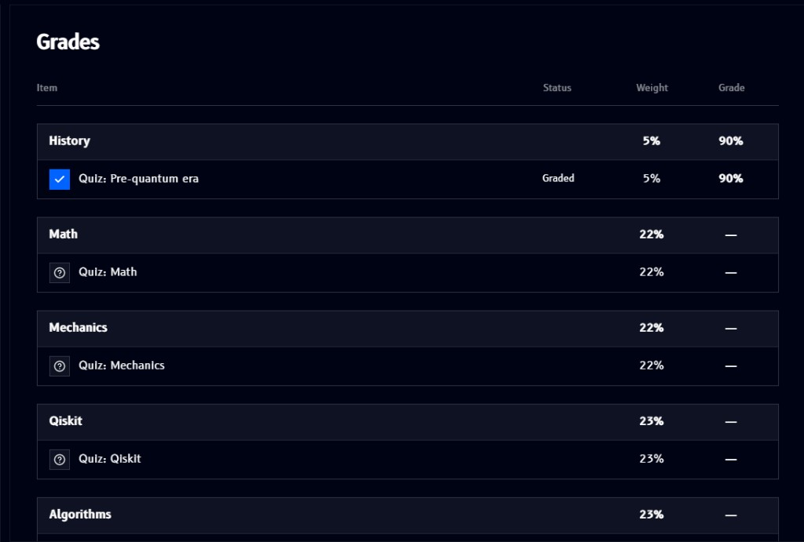

# Grades

**Grades**, found in the [sidebar](overview.md#sidebar) below the modules list, shows every graded item across the track in one table:

- Each **module** is a row (**History**, **Math**, **Mechanics**, **Qiskit**, **Algorithms**, ...), with its own **Weight**, how much it counts toward your final grade, and an overall **Grade** for that module
- Underneath each module, its individual graded items (currently quizzes, e.g. `Quiz: Pre-quantum era`) list their own **Status** (`Graded`, or a `?` icon if not yet attempted), **Weight**, and **Grade**
- A module's grade shows as a dash (`-`) until you've completed its graded item(s)

In the example above, **History**'s `Quiz: Pre-quantum era` is graded at 90%, while **Math**, **Mechanics**, **Qiskit**, and **Algorithms** are still ungraded.
