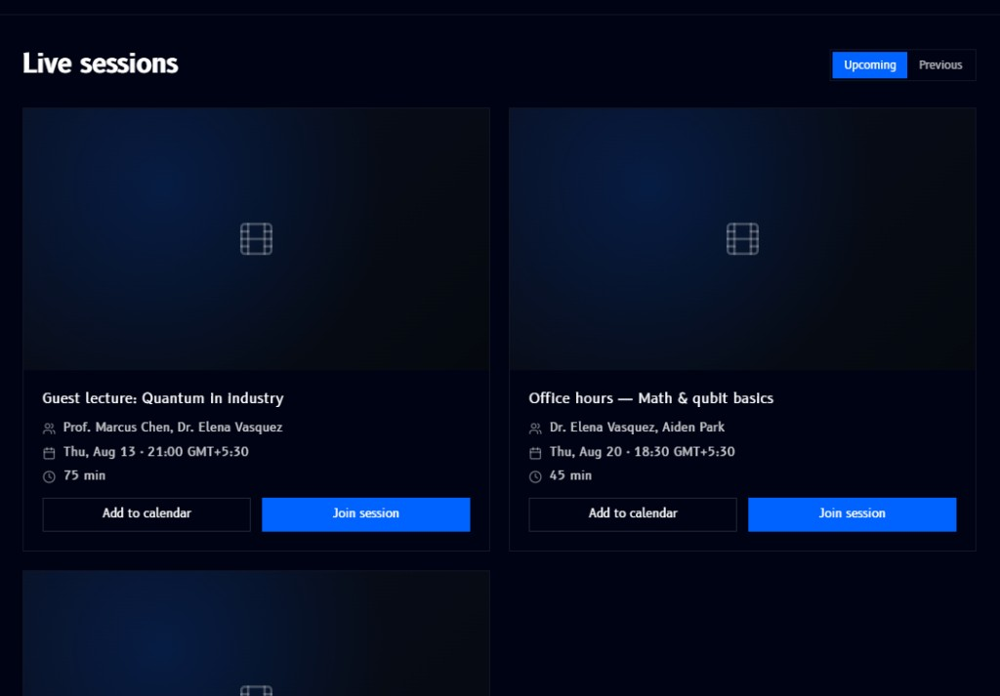

# Live Sessions

**Live Sessions**, found in the [sidebar](overview.md#sidebar) below the modules list, lists scheduled sessions as cards, guest lectures, office hours, and similar events that happen alongside the self-paced module content:

- **Upcoming** / **Previous** toggle (top right) switches between sessions still to come and ones that have already happened
- Each card shows a video thumbnail, the session's **title**, its **presenter(s)**, the **date and time** (in your local timezone), and its **duration**
- **Add to calendar** adds the session to your calendar app
- **Join session** opens the live session once it's able to be joined

!!! note
    The specific sessions shown above, "Guest lecture: Quantum in industry," "Office hours - Math & qubit basics," are just examples of what a card looks like, not a fixed or current schedule.
