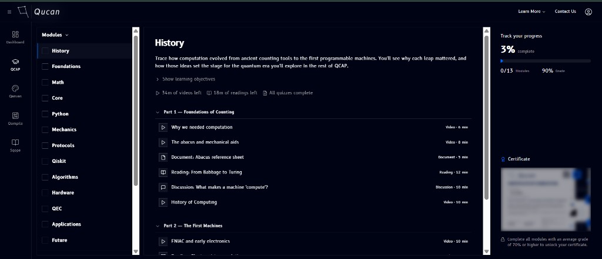

# Tour of QCAP

QCAP's interface has a left icon rail, a sidebar, a main content area, and a right-hand progress panel:

## Icon rail

The narrow strip on the far left (**Dashboard**, **QCAP**, **Qanvas**, **Qompile**, **Sqope**) is the same module switcher used across the whole platform, not specific to QCAP.

## Sidebar

Next to the icon rail, the QCAP sidebar has two parts:

- **Modules** - the full list of modules, in order: `History`, `Foundations`, `Math`, `Core`, `Python`, `Mechanics`, `Protocols`, `Qiskit`, `Algorithms`, `Hardware`, `QEC`, `Applications`, `Future`. Clicking one loads its page in the main content area, see [Modules](modules.md).
- A second row of links to course-wide sections rather than a specific module: [Live Sessions](live-sessions.md), [Grades](grades.md), [Announcements](announcements.md), [Discussions Forum](discussions.md), [Classmates](classmates.md), and [Resources](resources.md).

## Main content area

Selecting a module shows its page, description, learning objectives, progress, and lessons grouped into Parts. See [Modules](modules.md) for how that page is laid out.

## Progress panel

To the right, **Track your progress** summarizes your standing across the whole track: an overall completion percentage, how many of the 13 modules you've finished, and your average grade. Below it, a **Certificate** card stays locked (shown blurred) until you complete every module with an average grade of 70% or higher, see [Certificate](certificate.md).
