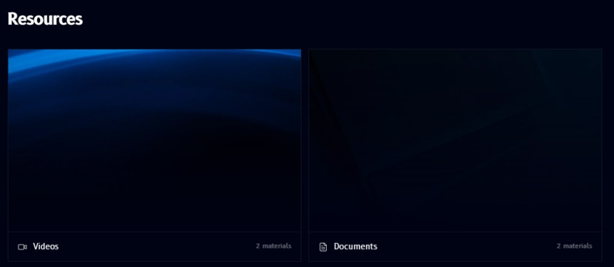

# Resources

**Resources**, found in the [sidebar](overview.md#sidebar) below the modules list, collects supplementary material outside the module lessons themselves:

Material is grouped into categories shown as cards, for example **Videos** and **Documents**, each with a count of how many materials it holds. Opening a category lists its individual items.
