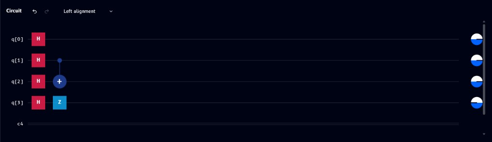

# Bell states

A **Bell state** is the simplest example of quantum entanglement - a two-qubit state where measuring one qubit instantly determines the outcome of the other. It's built with just two gates: a **Hadamard** to create superposition, followed by a **CNOT** to entangle the qubits.

## Circuit



## Code

The same circuit, shown across all four supported languages:

=== "OpenQASM"

    ```qasm
    OPENQASM 2.0;
    include "qelib1.inc";

    qreg q[3];
    creg c[3];

    h q[0];
    cx q[0], q[1];
    ```

=== "Qiskit"

    ```python
    from qiskit import QuantumRegister, ClassicalRegister, QuantumCircuit
    from numpy import pi

    qreg_q = QuantumRegister[3, 'q']
    creg_c = ClassicalRegister[3, 'c']
    circuit = QuantumCircuit[qreg_q, creg_c]

    circuit.h[qreg_q[0]]
    circuit.cx[qreg_q[0], qreg_q[1]]
    ```

=== "Cirq"

    ```python
    import cirq
    import math

    q = cirq.LineQubit.range[3]
    circuit = cirq.Circuit[]
    circuit.append[cirq.H[q[0]]]
    circuit.append[cirq.CNOT[q[0], q[1]]]
    print[circuit]
    ```

=== "Q#"

    ```qsharp
    namespace QompileCircuit {
        open Microsoft.Quantum.Canon;
        open Microsoft.Quantum.Intrinsic;
        open Microsoft.Quantum.Math;
        open Microsoft.Quantum.Convert;

        operation Circuit() : Result[] {
            use q = Qubit[3];
            mutable c = [Zero, size = 3];

            H(q[0]);
            CNOT(q[0], q[1]);

            ResetAll(q);
            return c;
        }
    }
    ```

See [Build your circuit with code](../tour/code/openqasm.md) for details on the bracket-vs-parentheses quirk in the Qiskit and Cirq views.

## What you'll see

- **[Probabilities](../tour/visualizations/probabilities.md)** - two equal bars, each at 50%, for the two correlated outcomes
- **[Q-Sphere](../tour/visualizations/q-sphere.md)** - two points on the sphere, one for each basis state in the superposition
- **[Statevector](../tour/visualizations/statevector.md)** - two non-zero amplitudes of equal magnitude (≈0.707), confirming an equal-superposition entangled state
