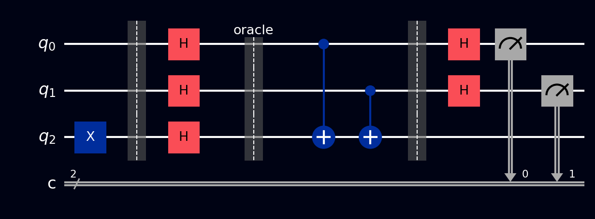

# Deutsch-Jozsa

Deutsch-Jozsa was the first algorithm to prove, cleanly and provably, that a quantum computer can beat any classical one at *something*. The problem it solves is admittedly artificial, but the machinery it introduced - oracles, phase kickback, and interference between computation paths - powers nearly every algorithm that came after it. Understand this page well and [Bernstein-Vazirani](bernstein-vazirani.md), [Simon's](simons.md), and [Grover's](grovers.md) become much easier.

## Why this exists

Here's the game. You're given a mystery function \( f \) that takes an \( n \)-bit input and outputs a single bit. You're **promised** it's one of two kinds:

- **Constant** - it outputs the same value for every input (all 0s, or all 1s)
- **Balanced** - it outputs 0 for exactly half the inputs and 1 for the other half

Your job: figure out which kind, asking the function as few times as possible.

Classically, in the worst case you must ask \( 2^{n-1} + 1 \) times - check one more than half the inputs, because until then the answers you've seen could still be the start of a balanced function. For \( n = 100 \), that's more queries than atoms in your body.

Deutsch-Jozsa answers with certainty in **one query**. Not fewer-on-average, not probably-correct - exactly one call to the function, every time.

## What you need to know first

### What an oracle is

The algorithm treats \( f \) as a **black box** or **oracle**: a circuit fragment you can use but not look inside. Since quantum circuits must be reversible, the standard packaging is a unitary \( U_f \) acting on the input register plus one extra **ancilla** qubit:

\[ U_f\,|x\rangle|y\rangle = |x\rangle\,|y \oplus f(x)\rangle \]

In words: leave the input \( x \) alone, and XOR the function's answer into the ancilla \( y \). (\( \oplus \) is XOR - addition mod 2. Khan Academy has a quick [XOR primer](https://www.khanacademy.org/computing/computer-science/cryptography/ciphers/a/xor-bitwise-operation) if it's new.) Running this on an ordinary input like \( |x\rangle|0\rangle \) just computes \( f(x) \) into the ancilla - nothing quantum yet. The quantum advantage comes from what happens when you feed it superpositions.

### Phase kickback

This is the trick students trip over most, so take it slowly. Prepare the ancilla in the special state

\[ |-\rangle = \frac{|0\rangle - |1\rangle}{\sqrt{2}} \]

(made by applying [X](../gates/pauli-x.md) then [H](../gates/hadamard.md) to \( |0\rangle \)). Now feed the oracle \( |x\rangle|-\rangle \). XOR-ing a bit \( b \) into \( |-\rangle \) does something curious:

- If \( f(x) = 0 \): nothing changes.
- If \( f(x) = 1 \): \( |0\rangle - |1\rangle \) becomes \( |1\rangle - |0\rangle \), i.e. the whole state picks up a factor of \( -1 \).

So the ancilla never changes (it stays \( |-\rangle \) throughout, and we can ignore it from here on), but the input branch \( |x\rangle \) acquires a **sign** that depends on the function's answer:

\[ U_f\,|x\rangle|-\rangle = (-1)^{f(x)}\,|x\rangle|-\rangle \]

The function's output has been converted from a *bit written somewhere* into a *phase stamped onto the input*. That matters because phases are exactly the thing interference can act on.

### Interference

When amplitudes with opposite signs meet, they cancel; with matching signs, they reinforce. Deutsch-Jozsa is engineered so that all the "constant" evidence piles up on one measurement outcome and all the "balanced" evidence cancels it out perfectly. The final Hadamards are what make the amplitudes meet.

## How it works, step by step

Circuit shape, for \( n \) input qubits plus one ancilla:

1. **Prepare the ancilla:** X then H on the ancilla, putting it in \( |-\rangle \).
2. **Superpose the inputs:** H on every input qubit. The input register now holds an equal superposition of all \( 2^n \) bitstrings at once.
3. **One oracle call:** apply \( U_f \). By phase kickback, every branch \( |x\rangle \) is now tagged with \( (-1)^{f(x)} \). One call - and every input has been "asked."
4. **Interfere:** H on every input qubit again.
5. **Measure the input register:**
    - Every qubit reads **0** → \( f \) is **constant**
    - Anything else → \( f \) is **balanced**

## The math

Only one amplitude needs computing: the amplitude of the all-zeros outcome after the final Hadamards. Applying H to each qubit of a basis state \( |x\rangle \) and collecting the \( |0\ldots0\rangle \) component contributes \( \frac{1}{\sqrt{2^n}} \) per branch, so the final amplitude of \( |0\ldots0\rangle \) is the plain average of all the phase tags:

\[ A_{0\ldots0} = \frac{1}{2^n} \sum_{x} (-1)^{f(x)} \]

- **Constant \( f \):** every term in the sum is the same sign, so \( A_{0\ldots0} = \pm 1 \). Probability of measuring all zeros: \( |A|^2 = 1 \). Guaranteed.
- **Balanced \( f \):** exactly half the terms are \( +1 \) and half are \( -1 \), so they cancel to \( A_{0\ldots0} = 0 \). Probability of all zeros: exactly 0. Guaranteed.

That's the entire proof. The promise (constant-or-balanced) is what makes the two cases perfectly distinguishable in one shot.

## A worked example

Take \( n = 2 \) and the balanced function \( f(x_1 x_0) = x_0 \) (output = the low input bit). Its oracle is simply a [CNOT](../gates/cnot.md) from `q[0]` to the ancilla - check it against the definition: it XORs \( x_0 \) into \( y \).

After step 2 the input register is \( \frac{1}{2}(|00\rangle + |01\rangle + |10\rangle + |11\rangle) \). The oracle stamps \( (-1)^{x_0} \) on each branch:

\[ \frac{1}{2}\big(|00\rangle - |01\rangle + |10\rangle - |11\rangle\big) \]

Factor it: \( \frac{|0\rangle + |1\rangle}{\sqrt{2}} \otimes \frac{|0\rangle - |1\rangle}{\sqrt{2}} = |+\rangle|-\rangle \). The final Hadamards send \( |+\rangle \to |0\rangle \) and \( |-\rangle \to |1\rangle \), so the register ends in \( |01\rangle \). Not all zeros → **balanced**, with certainty. Had the oracle been empty (constant \( f = 0 \)), the register would have returned to \( |00\rangle \) → constant.

## The circuit

For \( n = 2 \), build on 3 qubits (`q[0]`, `q[1]` inputs; `q[2]` ancilla), or load it from the [Ready algorithms](../tour/drag-drop/operations.md#switching-to-ready-algorithms) panel:

=== "Balanced oracle"

    1. X on `q[2]`, then H on `q[2]` (the \( |-\rangle \) ancilla)
    2. H on `q[0]` and `q[1]`
    3. **Oracle:** CNOT `q[0]` → `q[2]`
    4. H on `q[0]` and `q[1]`
    5. [Measure](../gates/measurement.md) `q[0]` and `q[1]` - result `01`, never `00`

=== "Constant oracle"

    Same circuit with **no gates in the oracle slot** (that's \( f = 0 \); for \( f = 1 \), put a single X on `q[2]` there instead - the result is the same).

    Measuring `q[0]` and `q[1]` gives `00` every time.

References for the circuit layout: [Wikipedia: Deutsch-Jozsa algorithm](https://en.wikipedia.org/wiki/Deutsch%E2%80%93Jozsa_algorithm) and [IBM Quantum Learning: Quantum query algorithms](https://learning.quantum.ibm.com/course/fundamentals-of-quantum-algorithms/quantum-query-algorithms).

## The circuit in code



The balanced-oracle circuit (\( n = 2 \), \( f(x) = x_0 \)). [Barriers](../gates/barrier.md) separate the three phases: ancilla + input setup, oracle, and interference + measurement.

=== "OpenQASM 2.0"

    ```qasm
    OPENQASM 2.0;
    include "qelib1.inc";

    qreg q[3];
    creg c[2];

    // Ancilla into |->
    x q[2];
    h q[2];

    // Superpose inputs
    h q[0];
    h q[1];
    barrier q;

    // Oracle: f(x) = x0  (CNOT from q0 to ancilla)
    cx q[0], q[2];
    barrier q;

    // Interfere and measure inputs only
    h q[0];
    h q[1];
    measure q[0] -> c[0];
    measure q[1] -> c[1];
    ```

=== "OpenQASM 3.0"

    ```qasm
    OPENQASM 3.0;
    include "stdgates.inc";

    qubit[3] q;
    bit[2] c;

    // Ancilla into |->
    x q[2];
    h q[2];

    // Superpose inputs
    h q[0];
    h q[1];
    barrier q;

    // Oracle: f(x) = x0
    cx q[0], q[2];
    barrier q;

    // Interfere and measure inputs only
    h q[0];
    h q[1];
    c[0] = measure q[0];
    c[1] = measure q[1];
    ```

=== "Qiskit"

    ```python
    from qiskit import QuantumCircuit
    from qiskit_aer import AerSimulator

    n = 2
    qc = QuantumCircuit(n + 1, n)  # n inputs + 1 ancilla, n classical bits

    # Phase-kickback setup: ancilla into |->
    qc.x(n)
    qc.h(n)

    # All 2^n inputs in superposition with one line
    qc.h(range(n))
    qc.barrier()

    # The entire oracle: f(x) = x0 is just one CNOT.
    # Swap in any circuit computing f into the ancilla here.
    qc.cx(0, n)
    qc.barrier()

    # Final Hadamards translate phases into measurable bits
    qc.h(range(n))
    qc.measure(range(n), range(n))

    # Output: {'01': 1024} for balanced, {'00': 1024} for constant
    counts = AerSimulator().run(qc, shots=1024).result().get_counts()
    print(counts)
    ```

=== "Cirq"

    ```python
    import cirq

    q = cirq.LineQubit.range(3)

    circuit = cirq.Circuit()
    # Ancilla into |->
    circuit.append(cirq.X(q[2]))
    circuit.append(cirq.H(q[2]))

    # Superpose inputs
    circuit.append(cirq.H(q[0]))
    circuit.append(cirq.H(q[1]))
    circuit.append(cirq.ops.Moment())  # barrier

    # Oracle: f(x) = x0
    circuit.append(cirq.CNOT(q[0], q[2]))
    circuit.append(cirq.ops.Moment())  # barrier

    # Interfere and measure inputs only
    circuit.append(cirq.H(q[0]))
    circuit.append(cirq.H(q[1]))
    circuit.append(cirq.measure(q[0], q[1], key='result'))
    print(circuit)
    ```

=== "Q#"

    ```qsharp
    namespace QompileCircuit {
        open Microsoft.Quantum.Canon;
        open Microsoft.Quantum.Intrinsic;

        operation Circuit() : Result[] {
            use q = Qubit[3];
            mutable c = [Zero, size = 2];

            // Ancilla into |->
            X(q[2]);
            H(q[2]);

            // Superpose inputs
            H(q[0]);
            H(q[1]);

            // Oracle: f(x) = x0
            CNOT(q[0], q[2]);

            // Interfere and measure inputs only
            H(q[0]);
            H(q[1]);
            set c w/= 0 <- M(q[0]);
            set c w/= 1 <- M(q[1]);

            ResetAll(q);
            return c;
        }
    }
    ```

## What you'll see

- **[Probabilities](../tour/visualizations/probabilities.md)** - a single 100% bar: on the all-zeros outcome for a constant oracle, on some nonzero outcome for a balanced one.
- **[Q-Sphere](../tour/visualizations/q-sphere.md)** - pause after the oracle (before the final Hadamards) and you'll see all input branches present with phase colors encoding the \( (-1)^{f(x)} \) tags - the answer is already written in the phases, and the final Hadamards just translate it into something measurable.
- **[Statevector](../tour/visualizations/statevector.md)** - after the oracle, equal magnitudes with mixed signs for balanced (uniform signs for constant); after the final Hadamards, a single unit amplitude.
