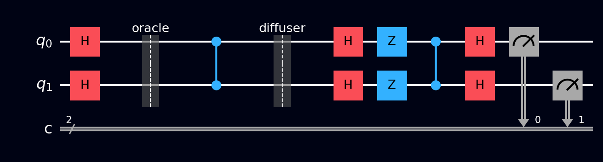

# Grover's algorithm

Grover's algorithm searches an unstructured list of \( N \) items in about \( \sqrt{N} \) steps, where any classical search needs about \( N \). It's the most broadly applicable quantum algorithm there is: anything you can phrase as "recognize the right answer when you see it" - database search, constraint solving, brute-forcing a key - gets this quadratic speedup.

## Why this exists

Imagine a phone book with a million entries, sorted by name, and you have only a phone number. No sorting helps you; the entries are in effectively random order with respect to what you're searching by. Classically your only move is to check entries one by one: on average half a million checks, worst case a million.

Grover's algorithm finds the entry in about \( \frac{\pi}{4}\sqrt{N} \approx 785 \) steps for a million items. Quadratic rather than exponential speedup, but with almost no fine print: it doesn't need the problem to have any special structure, just a way to *recognize* the answer. That recognition test becomes the oracle.

One important expectation to set: Grover's doesn't "look at all items and pick the right one" in a single step. It **gradually amplifies** the right answer's amplitude over many iterations while the wrong answers' amplitudes shrink. The magic is in how few iterations that takes.

## What you need to know first

- **Oracles** - covered in [Deutsch-Jozsa: what an oracle is](deutsch-jozsa.md#what-an-oracle-is). Grover's uses a **phase oracle**: instead of writing the answer into an ancilla, it flips the *sign* of the marked item's amplitude and leaves everything else alone. (Any ordinary recognizing circuit converts into a phase oracle with the \( |-\rangle \) ancilla trick from that same page.)
- **Amplitudes vs probabilities** - a state's amplitude is the signed (in general complex) number whose *square* gives the probability. Grover's works entirely on amplitudes, using the sign flips that probabilities can't see.
- **Mean/average of a list of numbers** - genuinely just that. The diffusion step reflects amplitudes about their average. Khan Academy's [statistics basics](https://www.khanacademy.org/math/statistics-probability/summarizing-quantitative-data) covers it in the first lesson.
- Some **trigonometry** helps for the iteration-count analysis: [unit circle and sine](https://www.khanacademy.org/math/trigonometry/unit-circle-trig-func).

## How it works, step by step

Search space: all \( N = 2^n \) bitstrings on \( n \) qubits. One of them, \( |w\rangle \) (the "winner"), is marked by the oracle.

1. **Superpose everything:** H on every qubit. All \( N \) items now have equal amplitude \( \frac{1}{\sqrt{N}} \).
2. **Grover iteration** (repeat \( \approx \frac{\pi}{4}\sqrt{N} \) times):
    - **Oracle:** flip the sign of the winner's amplitude. Nothing measurable changes yet - probabilities are amplitude *squared* - but the winner is now tagged.
    - **Diffusion (inversion about the mean):** replace every amplitude \( a \) with \( 2\bar{a} - a \), where \( \bar{a} \) is the average of all amplitudes. Everything reflects through the average. The winner, sitting far *below* the average after its sign flip, gets catapulted far *above* it; everyone else shrinks slightly.
3. **Measure:** the winner comes out with high probability.

Why can't you just iterate forever until the winner has probability 1? Because the process is a rotation, not a ratchet - overshoot the right count and the winner's amplitude starts *decreasing* again. The analysis below makes this precise.

## The math

The whole evolution lives in a 2D plane spanned by \( |w\rangle \) (the winner) and the uniform superposition of all the losers. Define \( \sin\theta = \frac{1}{\sqrt{N}} \); the starting state sits at angle \( \theta \) above the all-losers axis. Each Grover iteration is two reflections (oracle = reflect across the losers axis, diffusion = reflect across the starting state), and two reflections make a **rotation by \( 2\theta \)** toward the winner.

After \( k \) iterations the probability of measuring the winner is

\[ P(w) = \sin^2\big((2k+1)\,\theta\big) \]

You want \( (2k+1)\theta \approx \frac{\pi}{2} \), giving the optimal iteration count

\[ k \approx \frac{\pi}{4}\sqrt{N} \]

That square root is the entire speedup, and the sine curve explains the overshoot warning: keep iterating past the peak and \( P(w) \) falls back down. Grover's is provably optimal, too - no quantum algorithm can do unstructured search in fewer than \( \Omega(\sqrt{N}) \) queries, so the quadratic speedup is the final word.

## A worked example

Take \( n = 2 \), so \( N = 4 \) items, with winner \( |11\rangle \). Here \( \sin\theta = \frac{1}{2} \) means \( \theta = 30° \), and \( (2k+1)\theta = 90° \) at exactly \( k = 1 \): **one iteration finds the winner with certainty**. Track the four amplitudes by hand:

| | \( \lvert 00\rangle \) | \( \lvert 01\rangle \) | \( \lvert 10\rangle \) | \( \lvert 11\rangle \) |
|---|---|---|---|---|
| After H layer | 0.5 | 0.5 | 0.5 | 0.5 |
| After oracle | 0.5 | 0.5 | 0.5 | **−0.5** |
| After diffusion | 0 | 0 | 0 | **1.0** |

The diffusion arithmetic: the average of \( (0.5, 0.5, 0.5, -0.5) \) is \( \bar{a} = 0.25 \). Each amplitude becomes \( 2\bar{a} - a \): the losers get \( 0.5 - 0.5 = 0 \), the winner gets \( 0.5 + 0.5 = 1.0 \). Every shot now returns `11`.

## The circuit

For the \( N = 4 \), winner-\( |11\rangle \) example, build on 2 qubits (or load it from the [Ready algorithms](../tour/drag-drop/operations.md#switching-to-ready-algorithms) panel). A controlled-Z (CZ) is a [Z](../gates/pauli-z.md) gate with a [control](../gates/control.md) attached; it flips the sign of \( |11\rangle \) only, which is exactly the oracle we need.

1. **Superpose:** H on `q[0]` and `q[1]`
2. **Oracle:** CZ between `q[0]` and `q[1]`
3. **Diffusion:** H on both, [X](../gates/pauli-x.md) on both, CZ, X on both, H on both
4. [Measure](../gates/measurement.md) both qubits - `11` every time

To mark a different winner, sandwich the oracle's CZ with X gates on the qubits that should read 0 (e.g. winner \( |01\rangle \): X on `q[1]`, CZ, X on `q[1]`).

References for the circuit layout: [Wikipedia: Grover's algorithm](https://en.wikipedia.org/wiki/Grover%27s_algorithm) and [IBM Quantum Learning: Grover's algorithm](https://learning.quantum.ibm.com/course/fundamentals-of-quantum-algorithms/grovers-algorithm).

## The circuit in code



The \( N = 4 \), winner-\( |11\rangle \) circuit (one Grover iteration, 2 qubits). [Barriers](../gates/barrier.md) separate the three phases: superposition, oracle, and diffusion + measurement.

=== "OpenQASM 2.0"

    ```qasm
    OPENQASM 2.0;
    include "qelib1.inc";

    qreg q[2];
    creg c[2];

    // Superpose
    h q[0];
    h q[1];
    barrier q;

    // Oracle: flip the sign of |11>
    cz q[0], q[1];
    barrier q;

    // Diffusion: inversion about the mean
    h q[0];
    h q[1];
    x q[0];
    x q[1];
    cz q[0], q[1];
    x q[0];
    x q[1];
    h q[0];
    h q[1];

    measure q -> c;
    ```

=== "OpenQASM 3.0"

    ```qasm
    OPENQASM 3.0;
    include "stdgates.inc";

    qubit[2] q;
    bit[2] c;

    // Superpose
    h q[0];
    h q[1];
    barrier q;

    // Oracle: flip the sign of |11>
    cz q[0], q[1];
    barrier q;

    // Diffusion: inversion about the mean
    h q[0];
    h q[1];
    x q[0];
    x q[1];
    cz q[0], q[1];
    x q[0];
    x q[1];
    h q[0];
    h q[1];

    c = measure q;
    ```

=== "Qiskit"

    ```python
    from qiskit import QuantumCircuit
    from qiskit_aer import AerSimulator

    qc = QuantumCircuit(2, 2)

    # Uniform superposition over all four items
    qc.h([0, 1])
    qc.barrier()

    # Oracle: CZ flips the sign of |11> only.
    # Replace with your own recognition test as a phase flip.
    qc.cz(0, 1)
    qc.barrier()

    # Diffusion (reflect about the uniform state):
    # H-X maps the uniform state onto |11>, CZ flips everything
    # except that reference, then X-H maps back.
    qc.h([0, 1])
    qc.x([0, 1])
    qc.cz(0, 1)
    qc.x([0, 1])
    qc.h([0, 1])

    qc.measure([0, 1], [0, 1])

    # N=4 hits certainty at k=1 iteration. Output: {'11': 1024}
    counts = AerSimulator().run(qc, shots=1024).result().get_counts()
    print(counts)
    ```

=== "Cirq"

    ```python
    import cirq

    q = cirq.LineQubit.range(2)

    circuit = cirq.Circuit()
    # Superpose
    circuit.append([cirq.H(q[0]), cirq.H(q[1])])
    circuit.append(cirq.ops.Moment())  # barrier

    # Oracle: flip the sign of |11>
    circuit.append(cirq.CZ(q[0], q[1]))
    circuit.append(cirq.ops.Moment())  # barrier

    # Diffusion: inversion about the mean
    circuit.append([cirq.H(q[0]), cirq.H(q[1])])
    circuit.append([cirq.X(q[0]), cirq.X(q[1])])
    circuit.append(cirq.CZ(q[0], q[1]))
    circuit.append([cirq.X(q[0]), cirq.X(q[1])])
    circuit.append([cirq.H(q[0]), cirq.H(q[1])])

    circuit.append(cirq.measure(*q, key='result'))
    print(circuit)
    ```

=== "Q#"

    ```qsharp
    namespace QompileCircuit {
        open Microsoft.Quantum.Canon;
        open Microsoft.Quantum.Intrinsic;

        operation Circuit() : Result[] {
            use q = Qubit[2];
            mutable c = [Zero, size = 2];

            // Superpose
            H(q[0]);
            H(q[1]);

            // Oracle: flip the sign of |11>
            CZ(q[0], q[1]);

            // Diffusion: inversion about the mean
            H(q[0]);
            H(q[1]);
            X(q[0]);
            X(q[1]);
            CZ(q[0], q[1]);
            X(q[0]);
            X(q[1]);
            H(q[0]);
            H(q[1]);

            set c w/= 0 <- M(q[0]);
            set c w/= 1 <- M(q[1]);

            ResetAll(q);
            return c;
        }
    }
    ```

## What you'll see

- **[Probabilities](../tour/visualizations/probabilities.md)** - a single bar at 100% on `11`. For a genuinely instructive view, place snapshots between stages and watch the histogram morph from flat, to flat (the oracle's sign flip is invisible here), to fully concentrated.
- **[Q-Sphere](../tour/visualizations/q-sphere.md)** - after the oracle: four equal points, with \( |11\rangle \) phase-colored opposite to the rest. This is the clearest picture of "tagged but not yet amplified."
- **[Statevector](../tour/visualizations/statevector.md)** - the table from the worked example, live: \( (0.5, 0.5, 0.5, 0.5) \) → \( (0.5, 0.5, 0.5, -0.5) \) → \( (0, 0, 0, 1) \).
