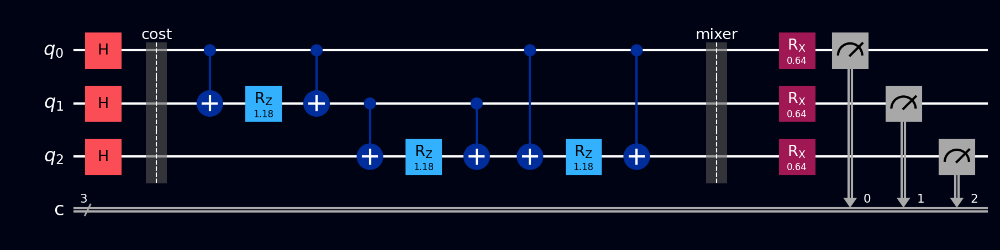

# QAOA

The **Quantum Approximate Optimization Algorithm** attacks combinatorial optimization problems - scheduling, routing, portfolio selection, network partitioning - by teaming a small, shallow quantum circuit with an ordinary classical optimizer. It's one of the flagship algorithms for today's noisy, limited-qubit hardware, because the circuit stays short and the classical computer does the heavy lifting of tuning it.

## Why this exists

Combinatorial optimization problems share a painful shape: an enormous number of candidate solutions (bitstrings), a score for each one, and no better classical strategy in general than clever variations on "try lots of them." Many of these problems are NP-hard, and nobody expects any computer, quantum or classical, to solve them exactly and efficiently.

QAOA aims for something more modest and more practical: **good solutions, fast**. It prepares a quantum state that concentrates probability on high-scoring bitstrings, so that measuring it gives you very good candidates with high likelihood. The state is prepared by a circuit with a handful of tunable knobs, and a classical optimizer turns those knobs to make the measured scores as good as possible.

The standard showcase problem, used on this page, is **MaxCut**: given a network of nodes and edges, split the nodes into two groups so that as many edges as possible run *between* the groups.

## What you need to know first

- **Cost functions.** Every optimization problem gets encoded as a function \( C(z) \) that scores each bitstring \( z \). For MaxCut: assign each node a bit (which group it's in), and \( C(z) \) counts the edges whose endpoints got different bits.
- **Cost Hamiltonians.** A **Hamiltonian** is an operator whose role here is simple: it's the quantum version of the score sheet. Encode the cost so that each basis state \( |z\rangle \) is scored by \( C(z) \). The useful building block is the observation that \( Z_i Z_j \) (a [Pauli-Z](../gates/pauli-z.md) on qubits \( i \) and \( j \)) gives \( +1 \) when bits \( i \) and \( j \) agree and \( -1 \) when they differ - a one-term "is this edge cut?" detector. ([VQE](vqe.md) discusses Hamiltonians and expectation values in more depth.)
- **Expectation values.** \( \langle C \rangle \) is just the *average score* of the bitstrings you'd get by measuring the state many times. That's the number the classical optimizer tries to push up, and it's estimated directly from measurement counts.
- **A classical optimizer.** Anything that minimizes a function of a few real variables - even a grid search works for the two-parameter version here.

## How it works, step by step

The circuit has \( p \) layers (the "depth"); each layer has two knobs, an angle \( \gamma \) for the cost step and \( \beta \) for the mixer step. This page uses \( p = 1 \): two knobs total.

1. **Superpose:** H on every qubit - every possible grouping of the nodes, all at once, equally weighted.
2. **Cost layer (knob \( \gamma \)):** for each edge \( (i, j) \), apply [RZZ](../gates/rzz-gate.md)\( (2\gamma) \) between qubits \( i \) and \( j \). This stamps each bitstring-branch with a phase proportional to its score - good cuts and bad cuts start to spin apart in phase.
3. **Mixer layer (knob \( \beta \)):** [RX](../gates/rx-gate.md)\( (2\beta) \) on every qubit. Phases alone are invisible to measurement (a lesson from [Grover's](grovers.md)); the mixer converts the phase differences into amplitude differences, letting branches interfere so that high-scoring strings become more likely.
4. **Measure** all qubits, many shots, and compute the average cut value of the results.
5. **Classical loop:** an ordinary optimizer adjusts \( (\gamma, \beta) \) to maximize that average, re-running the circuit each try. When it converges, sample once more and keep the best bitstring seen.

Deeper circuits (\( p = 2, 3, \ldots \)) alternate more cost and mixer layers with their own knobs, approximating the ideal annealing process better at the price of a longer circuit.

## The math

For MaxCut the cost function is

\[ C(z) = \sum_{(i,j) \in E} \frac{1 - z_i z_j}{2}, \qquad z_i \in \{+1, -1\} \]

using the \( \pm1 \) convention for bits (node in group A = \( +1 \), group B = \( -1 \)): each edge term is 1 when the endpoints differ, 0 when they agree. Promote each \( z_i \) to the operator \( Z_i \) and this becomes the cost Hamiltonian \( C \to H_C \). The QAOA state with one layer is

\[ |\gamma, \beta\rangle = e^{-i\beta H_M}\, e^{-i\gamma H_C}\, H^{\otimes n} |0\ldots0\rangle \]

where \( H_M = \sum_i X_i \) is the mixer. The exponentials sound abstract but compile to plain gates: each edge's \( e^{-i\gamma Z_i Z_j} \) is exactly one RZZ\( (2\gamma) \) gate, and each \( e^{-i\beta X_i} \) is one RX\( (2\beta) \). The classical optimizer maximizes \( \langle \gamma, \beta | H_C | \gamma, \beta \rangle \), which is estimated by averaging \( C \) over measurement outcomes - no operator algebra needed at runtime.

## A worked example

Use the smallest interesting graph: a **triangle** - nodes 0, 1, 2, edges (0,1), (1,2), (0,2). Enumerate the eight groupings: `000` and `111` keep all nodes together (cut value 0); every other bitstring isolates one node and cuts 2 of the 3 edges (cut value 2, the maximum - you can never cut all 3 edges of a triangle, since some pair must land in the same group).

So the optimizer's job is to make the six value-2 strings likely and `000`/`111` rare. Run the \( p = 1 \) circuit and you'll find the average cut peaks around \( \gamma \approx 0.79, \beta \approx 0.39 \) (about \( \pi/4 \) and \( \pi/8 \)), where \( \langle C \rangle \approx 1.5 \) and the two worthless strings have visibly suppressed probability. Measuring then gives a maximum cut with high probability - and *any* of the six is a correct answer.

## The circuit

For the triangle at fixed \( (\gamma, \beta) = (0.79, 0.39) \), build on 3 qubits (or load QAOA from the [Ready algorithms](../tour/drag-drop/operations.md#switching-to-ready-algorithms) panel):

1. H on `q[0]`, `q[1]`, `q[2]`
2. **Cost layer:** RZZ(1.58) on the pair (`q[0]`, `q[1]`), then (`q[1]`, `q[2]`), then (`q[0]`, `q[2]`) - one per edge, angle \( 2\gamma \)
3. **Mixer layer:** RX(0.78) on each of the three qubits - angle \( 2\beta \)
4. [Measure](../gates/measurement.md) all three qubits

In Qompile you set the two angles by hand; the "classical loop" is you trying different values and watching the average improve, which is a genuinely good way to feel what the optimizer does.

References for the circuit layout: [Wikipedia: Quantum optimization algorithms](https://en.wikipedia.org/wiki/Quantum_optimization_algorithms) and [IBM Quantum Learning: Variational algorithm design](https://learning.quantum.ibm.com/course/variational-algorithm-design).

## The circuit in code



The triangle MaxCut circuit at \( (\gamma, \beta) = (0.79, 0.39) \). [Barriers](../gates/barrier.md) separate the three phases: superposition, cost layer, and mixer layer + measurement.

=== "OpenQASM 2.0"

    ```qasm
    OPENQASM 2.0;
    include "qelib1.inc";

    qreg q[3];
    creg c[3];

    // Superpose
    h q[0];
    h q[1];
    h q[2];
    barrier q;

    // Cost layer: RZZ(2*gamma) on each edge, gamma = 0.79
    rzz(1.58) q[0], q[1];
    rzz(1.58) q[1], q[2];
    rzz(1.58) q[0], q[2];
    barrier q;

    // Mixer layer: RX(2*beta) on each qubit, beta = 0.39
    rx(0.78) q[0];
    rx(0.78) q[1];
    rx(0.78) q[2];

    measure q -> c;
    ```

=== "OpenQASM 3.0"

    ```qasm
    OPENQASM 3.0;
    include "stdgates.inc";

    qubit[3] q;
    bit[3] c;

    // Superpose
    h q[0];
    h q[1];
    h q[2];
    barrier q;

    // Cost layer: RZZ(2*gamma) on each edge
    rzz(1.58) q[0], q[1];
    rzz(1.58) q[1], q[2];
    rzz(1.58) q[0], q[2];
    barrier q;

    // Mixer layer: RX(2*beta) on each qubit
    rx(0.78) q[0];
    rx(0.78) q[1];
    rx(0.78) q[2];

    c = measure q;
    ```

=== "Qiskit"

    ```python
    from qiskit import QuantumCircuit
    from qiskit_aer import AerSimulator
    from scipy.optimize import minimize

    edges = [(0, 1), (1, 2), (0, 2)]  # triangle graph
    n = 3
    sim = AerSimulator()

    def qaoa_circuit(gamma, beta):
        qc = QuantumCircuit(n, n)
        qc.h(range(n))                    # every grouping, equally weighted
        for i, j in edges:                # one RZZ per edge scores the cut
            qc.rzz(2 * gamma, i, j)
        qc.rx(2 * beta, range(n))         # mixer converts phases to amplitudes
        qc.measure(range(n), range(n))
        return qc

    def cut_value(bits):
        return sum(1 for i, j in edges if bits[i] != bits[j])

    def average_cut(params):
        counts = sim.run(qaoa_circuit(*params), shots=2048).result().get_counts()
        total = sum(cut_value(key[::-1]) * shots for key, shots in counts.items())
        return -total / 2048              # negative because optimizers minimize

    # COBYLA is gradient-free, suits noisy objective estimates
    result = minimize(average_cut, x0=[0.5, 0.5], method="COBYLA")
    print("best (gamma, beta):", result.x, " average cut:", -result.fun)

    # The six max-cut strings dominate; 000/111 trail far behind
    counts = sim.run(qaoa_circuit(*result.x), shots=2048).result().get_counts()
    print(sorted(counts.items(), key=lambda kv: -kv[1]))
    ```

=== "Cirq"

    ```python
    import cirq

    q = cirq.LineQubit.range(3)
    edges = [(0, 1), (1, 2), (0, 2)]
    gamma, beta = 0.79, 0.39

    circuit = cirq.Circuit()
    # Superpose
    circuit.append([cirq.H(q[i]) for i in range(3)])
    circuit.append(cirq.ops.Moment())  # barrier

    # Cost layer: RZZ(2*gamma) on each edge
    for i, j in edges:
        circuit.append(cirq.ZZPowGate(exponent=2 * gamma / 3.14159).on(q[i], q[j]))
    circuit.append(cirq.ops.Moment())  # barrier

    # Mixer layer: RX(2*beta) on each qubit
    circuit.append([cirq.rx(2 * beta).on(q[i]) for i in range(3)])

    circuit.append(cirq.measure(*q, key='result'))
    print(circuit)
    ```

=== "Q#"

    ```qsharp
    namespace QompileCircuit {
        open Microsoft.Quantum.Canon;
        open Microsoft.Quantum.Intrinsic;
        open Microsoft.Quantum.Math;

        operation Circuit() : Result[] {
            use q = Qubit[3];
            mutable c = [Zero, size = 3];

            let gamma = 0.79;
            let beta = 0.39;

            // Superpose
            H(q[0]);
            H(q[1]);
            H(q[2]);

            // Cost layer: Rzz(2*gamma) on each edge
            Exp([PauliZ, PauliZ], gamma, [q[0], q[1]]);
            Exp([PauliZ, PauliZ], gamma, [q[1], q[2]]);
            Exp([PauliZ, PauliZ], gamma, [q[0], q[2]]);

            // Mixer layer: Rx(2*beta) on each qubit
            Rx(2.0 * beta, q[0]);
            Rx(2.0 * beta, q[1]);
            Rx(2.0 * beta, q[2]);

            set c w/= 0 <- M(q[0]);
            set c w/= 1 <- M(q[1]);
            set c w/= 2 <- M(q[2]);

            ResetAll(q);
            return c;
        }
    }
    ```

## What you'll see

- **[Probabilities](../tour/visualizations/probabilities.md)** - at good \( (\gamma, \beta) \): six healthy bars on the cut-value-2 strings and two suppressed bars on `000` and `111`. At \( \gamma = \beta = 0 \) the histogram is perfectly flat - the knobs really are what create the bias.
- **[Q-Sphere](../tour/visualizations/q-sphere.md)** - after the cost layer, all eight branches with phase colors grouped by cut value (this is the score, written in phase); the mixer then converts that pattern into the size differences you see at the end.
- **[Statevector](../tour/visualizations/statevector.md)** - amplitudes cluster into two magnitude classes matching the two cost classes; watch them separate as you increase \( \gamma \) from zero.
