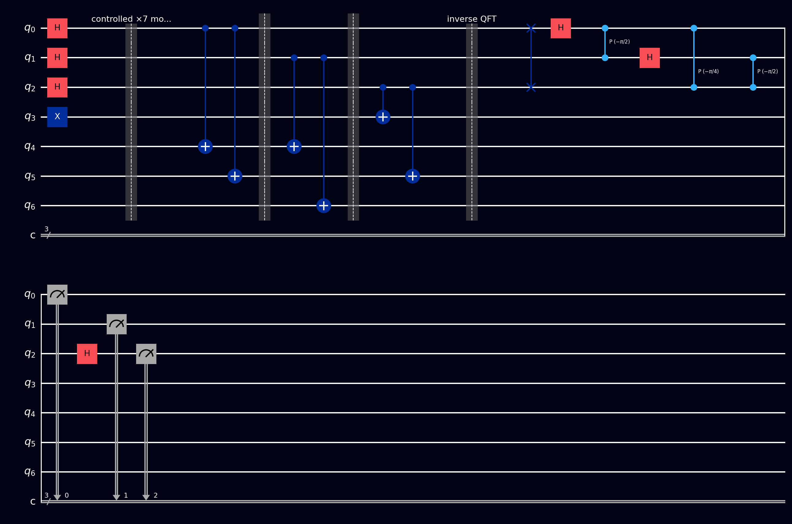

# Shor's

**Shor's algorithm** factors large numbers exponentially faster than the best known classical method. That one sentence is why quantum computing escaped the physics department: the security of most of the internet's encryption rests on factoring being hard, and in 1994 Peter Shor showed that a big enough quantum computer would make it easy.

## Why this exists

### RSA, the thing being threatened

**RSA** is the public-key encryption system that secures much of the web. Its key generation is disarmingly simple: pick two large prime numbers \( p \) and \( q \) (each hundreds of digits long), multiply them, and publish the product \( N = pq \) as your public key. Anyone can use \( N \) to encrypt a message to you, but *decrypting* requires knowing \( p \) and \( q \) separately.

The whole scheme rests on an asymmetry: multiplying two primes takes a microsecond, but recovering them from \( N \) is factoring, and for a 2048-bit \( N \) the best classical algorithm known (the general number field sieve) would need longer than the age of the universe. It's a padlock that snaps shut instantly but needs a key to reopen.

Shor's algorithm factors \( N \) in *polynomial* time - hours, not eons - on a large, error-corrected quantum computer. No such machine exists yet: today's hardware is far too small and noisy, and this page factors 15, which is honestly close to the state of the art. But the threat is taken seriously enough that "post-quantum" replacement cryptography is already being standardized and rolled out, partly because encrypted traffic recorded *today* could be decrypted by a future machine ("harvest now, decrypt later").

### The plan of attack

Shor's insight was that factoring can be converted into a different problem, **period finding**, and that period finding is something quantum computers are spectacularly good at. The algorithm is mostly classical bookkeeping wrapped around one quantum subroutine, and that subroutine is exactly [QPE](qpe.md) pointed at modular arithmetic.

## What you need to know first

### Modular arithmetic

"Clock math": \( a \bmod N \) is the remainder when \( a \) is divided by \( N \), so numbers wrap around like hours on a clock face. \( 49 \bmod 15 = 4 \), because \( 49 = 3 \times 15 + 4 \). Khan Academy's [What is modular arithmetic?](https://www.khanacademy.org/computing/computer-science/cryptography/modarithmetic/a/what-is-modular-arithmetic) is a friendly ground-up introduction.

### Periods of modular powers

Fix \( N \) and some number \( a \), and look at the sequence of powers \( a^1, a^2, a^3, \ldots \) all taken \( \bmod N \). Because there are only finitely many remainders, the sequence must eventually repeat, and it turns out to cycle with a fixed **period** \( r \): the smallest positive number with \( a^r \equiv 1 \pmod N \). For \( a = 7, N = 15 \):

\[ 7^1 = 7, \quad 7^2 = 4, \quad 7^3 = 13, \quad 7^4 = 1, \quad 7^5 = 7, \quad \ldots \pmod{15} \]

so the period is \( r = 4 \). For a cryptographically sized \( N \) the period is astronomically large, and no classical method finds it efficiently. This is the problem the quantum computer solves.

### Greatest common divisors

\( \gcd(x, y) \) is the largest number dividing both \( x \) and \( y \), and Euclid's algorithm computes it very fast even for enormous numbers - see Khan Academy's [The Euclidean algorithm](https://www.khanacademy.org/computing/computer-science/cryptography/modarithmetic/a/the-euclidean-algorithm). Shor's uses gcds to pull the actual prime factors out at the end.

### QPE and the eigenstate trick

Read [QPE](qpe.md) first if you haven't - including its explanations of unitaries, eigenvectors, and phase kickback, all of which are used here without further comment. Shor's applies QPE to the modular-multiplication operation

\[ U|y\rangle = |a \cdot y \bmod N\rangle \]

whose eigenvalues turn out to be \( e^{2\pi i s / r} \) for \( s = 0, 1, \ldots, r - 1 \): the period \( r \) is sitting inside every eigenvalue's phase, which is exactly the kind of number QPE reads out.

QPE normally needs an eigenstate handed to it, and we can't prepare one without already knowing \( r \). The elegant escape: the easy-to-prepare state \( |1\rangle \) is an *equal superposition of all \( r \) eigenstates*. Run QPE on \( |1\rangle \) and it behaves as if you'd fed it one eigenstate picked at random, returning \( \varphi = s/r \) for a random \( s \).

### Continued fractions

QPE hands back a decimal like \( 0.75 \), and we need the fraction \( s/r \) hiding inside it. The **continued fractions** algorithm finds the simplest fraction close to a given decimal ([Wikipedia: Continued fraction](https://en.wikipedia.org/wiki/Continued_fraction)); in code it's one call to Python's `Fraction(...).limit_denominator(N)`. The denominator of the result is the candidate period.

## How it works, step by step

The classical wrapper:

1. **Pick a random \( a \)** between 2 and \( N - 1 \), and compute \( \gcd(a, N) \). If it's bigger than 1 you got absurdly lucky - that gcd is already a factor, done.
2. **Find the period \( r \)** of \( a^x \bmod N \) using the quantum subroutine below.
3. **Check the two conditions:** \( r \) must be even, and \( a^{r/2} \) must not be \( \equiv -1 \pmod N \). If either fails, go back to step 1 with a new \( a \). (A random \( a \) passes with probability at least \( \tfrac{1}{2} \), so this rarely takes more than a couple of tries.)
4. **Extract the factors:** \( \gcd(a^{r/2} - 1, N) \) and \( \gcd(a^{r/2} + 1, N) \) are nontrivial factors of \( N \).

The quantum subroutine (period finding) is QPE with modular multiplication as its unitary:

1. **Counting register:** \( t \) qubits, H on each.
2. **Work register:** enough qubits to hold numbers up to \( N \), prepared in \( |1\rangle \).
3. **Controlled powers:** counting qubit \( j \) controls \( U^{2^j} \), i.e. multiplication by \( a^{2^j} \bmod N \).
4. **Inverse QFT** on the counting register, then **measure** it: read integer \( m \), giving \( \varphi = m/2^t \approx s/r \).
5. **Continued fractions** on \( \varphi \) recovers the candidate \( r \); verify it by checking \( a^r \equiv 1 \pmod N \).

## The math

Why does knowing the period crack the factoring problem? The period satisfies \( a^r \equiv 1 \pmod N \). If \( r \) is even, rewrite that as a difference of squares:

\[ a^r - 1 \equiv 0 \pmod N \quad\Longrightarrow\quad \left(a^{r/2} - 1\right)\left(a^{r/2} + 1\right) \equiv 0 \pmod N \]

So \( N \) divides that product. If neither bracket is itself a multiple of \( N \) (that's what the two conditions in step 3 guarantee), then \( N \)'s prime factors must be *split between* the two brackets - and \( \gcd \) with each bracket collects them.

Why does QPE find \( r \)? The eigenstates of \( U \) are

\[ |u_s\rangle = \frac{1}{\sqrt{r}} \sum_{k=0}^{r-1} e^{-2\pi i s k / r} \, |a^k \bmod N\rangle, \qquad U|u_s\rangle = e^{2\pi i s / r}|u_s\rangle \]

and summing them makes all the phases cancel except on \( k = 0 \), leaving exactly \( \frac{1}{\sqrt{r}} \sum_s |u_s\rangle = |1\rangle \). That's the eigenstate trick from above, now in symbols: QPE on \( |1\rangle \) measures \( s/r \) for a uniformly random \( s \).

## A worked example: factoring 15

Take \( N = 15 \), and say the random pick is \( a = 7 \) (with \( \gcd(7, 15) = 1 \), no early luck). From the powers table above, \( r = 4 \): even, and \( 7^{2} = 49 \equiv 4 \not\equiv -1 \pmod{15} \), so both conditions pass. Then:

\[ \gcd(7^2 - 1, 15) = \gcd(48, 15) = 3, \qquad \gcd(7^2 + 1, 15) = \gcd(50, 15) = 5 \]

and indeed \( 15 = 3 \times 5 \).

On the quantum side with \( t = 3 \) counting qubits, QPE returns \( s/4 \) for random \( s \in \{0, 1, 2, 3\} \), so the four outcomes below appear with roughly 25% probability each:

| Readout | Phase | Continued fractions says | Verdict |
|---|---|---|---|
| `000` | 0 | no information | retry |
| `010` | 1/4 | \( r = 4 \) | factors 3 and 5 |
| `100` | 1/2 | \( r = 2 \), but \( 7^2 \equiv 4 \neq 1 \) | fails verification, retry |
| `110` | 3/4 | \( r = 4 \) | factors 3 and 5 |

Half of all shots hand you the factors immediately; the algorithm expects and tolerates the duds.

## The circuit

This is the biggest build in this section: 7 qubits, with `q[0]`-`q[2]` counting and `q[3]`-`q[6]` the work register (`q[3]` least significant). The multiplications are pure bit permutations, built from [SWAP](../gates/swap.md) gates with a [control](../gates/control.md) attached; the ×7 step also needs controlled [X](../gates/pauli-x.md) gates (i.e. [CNOT](../gates/cnot.md)s), because ×7 mod 15 is "rotate the bits, then flip them all" (\( 7 \equiv -8 \), and negating mod 15 flips all four bits). Or skip the assembly and load Shor's from the [Ready algorithms](../tour/drag-drop/operations.md#switching-to-ready-algorithms) panel.

1. **Superpose:** H on `q[0]`, `q[1]`, `q[2]`
2. **Work register = 1:** X on `q[3]`
3. **Controlled ×7 from `q[0]`:** controlled-SWAP `q[3]`↔`q[4]`, then `q[4]`↔`q[5]`, then `q[5]`↔`q[6]`; then CNOT from `q[0]` to each of `q[3]`, `q[4]`, `q[5]`, `q[6]`
4. **Controlled ×4 from `q[1]`:** controlled-SWAP `q[4]`↔`q[6]`, then `q[3]`↔`q[5]`
5. `q[2]` would control ×\( 7^4 \bmod 15 \) = ×1, the identity - no gates needed
6. **Inverse QFT** on `q[0]`-`q[2]`, the same 7-gate sequence spelled out on the [QPE page](qpe.md#the-circuit)
7. [Measure](../gates/measurement.md) `q[0]`-`q[2]` - reads `000`, `010`, `100`, or `110`, about 25% each

References for the circuit layout: [Wikipedia: Shor's algorithm](https://en.wikipedia.org/wiki/Shor%27s_algorithm) and [IBM Quantum Learning: Phase estimation and factoring](https://learning.quantum.ibm.com/course/fundamentals-of-quantum-algorithms/phase-estimation-and-factoring).

## The circuit in code



The factor-15 circuit (\( a = 7 \), 3 counting + 4 work qubits). The controlled multiplications are expanded into [SWAP](../gates/swap.md) and [CNOT](../gates/cnot.md) gates. [Barriers](../gates/barrier.md) separate the phases: setup, controlled \( \times7 \), controlled \( \times4 \), inverse QFT, and measurement.

=== "OpenQASM 2.0"

    ```qasm
    OPENQASM 2.0;
    include "qelib1.inc";

    qreg q[7];
    creg c[3];

    // Superpose counting register
    h q[0];
    h q[1];
    h q[2];

    // Work register = 1
    x q[3];
    barrier q;

    // Controlled x7 mod 15, controlled by q[0]
    // x7 = x8 (rotate bits) then negate mod 15
    cswap q[0], q[3], q[4];
    cswap q[0], q[4], q[5];
    cswap q[0], q[5], q[6];
    cx q[0], q[3];
    cx q[0], q[4];
    cx q[0], q[5];
    cx q[0], q[6];
    barrier q;

    // Controlled x4 mod 15, controlled by q[1]
    cswap q[1], q[4], q[6];
    cswap q[1], q[3], q[5];
    barrier q;

    // q[2] controls x1 = identity, no gates needed

    // Inverse QFT on counting register
    swap q[0], q[2];
    h q[0];
    cp(-pi/2) q[0], q[1];
    h q[1];
    cp(-pi/4) q[0], q[2];
    cp(-pi/2) q[1], q[2];
    h q[2];

    measure q[0] -> c[0];
    measure q[1] -> c[1];
    measure q[2] -> c[2];
    ```

=== "OpenQASM 3.0"

    ```qasm
    OPENQASM 3.0;
    include "stdgates.inc";

    qubit[7] q;
    bit[3] c;

    // Superpose counting register
    h q[0];
    h q[1];
    h q[2];

    // Work register = 1
    x q[3];
    barrier q;

    // Controlled x7 mod 15, controlled by q[0]
    cswap q[0], q[3], q[4];
    cswap q[0], q[4], q[5];
    cswap q[0], q[5], q[6];
    cx q[0], q[3];
    cx q[0], q[4];
    cx q[0], q[5];
    cx q[0], q[6];
    barrier q;

    // Controlled x4 mod 15, controlled by q[1]
    cswap q[1], q[4], q[6];
    cswap q[1], q[3], q[5];
    barrier q;

    // Inverse QFT on counting register
    swap q[0], q[2];
    h q[0];
    cp(-pi/2) q[0], q[1];
    h q[1];
    cp(-pi/4) q[0], q[2];
    cp(-pi/2) q[1], q[2];
    h q[2];

    c[0] = measure q[0];
    c[1] = measure q[1];
    c[2] = measure q[2];
    ```

=== "Qiskit"

    ```python
    from math import gcd, pi
    from fractions import Fraction
    from qiskit import QuantumCircuit
    from qiskit.circuit.library import QFT
    from qiskit_aer import AerSimulator

    N, a, t = 15, 7, 3  # number to factor, base, counting qubits

    def controlled_mult(m):
        """Controlled multiplication by m mod 15 on 4 work qubits."""
        u = QuantumCircuit(4)
        if m == 7:
            # x7 = x8 (rotate bits) then negate mod 15
            u.swap(0, 1); u.swap(1, 2); u.swap(2, 3)
            for q in range(4):
                u.x(q)
        elif m == 4:
            u.swap(1, 3); u.swap(0, 2)  # x4: shift bits by two
        return u.to_gate(label=f"x{m} mod 15").control()

    qc = QuantumCircuit(t + 4, t)
    qc.h(range(t))                # counting register in superposition
    qc.x(t)                       # work register = |0001> = 1
    for j in range(t):
        m = pow(a, 2**j, N)       # classical repeated squaring
        if m != 1:                # x1 = identity, skip it
            qc.append(controlled_mult(m), [j] + list(range(t, t + 4)))
    qc.append(QFT(t, inverse=True), range(t))
    qc.measure(range(t), range(t))

    # Continued fractions recover r from the measured phase
    counts = AerSimulator().run(qc, shots=1024).result().get_counts()
    for bits in sorted(counts):
        phase = int(bits, 2) / 2**t
        r = Fraction(phase).limit_denominator(N).denominator
        if r % 2 == 0 and pow(a, r, N) == 1:
            print(bits, "-> r =", r,
                  "-> factors", gcd(a**(r//2)-1, N), gcd(a**(r//2)+1, N))
        else:
            print(bits, "-> retry")
    ```

=== "Cirq"

    ```python
    import cirq
    import numpy as np

    q = cirq.LineQubit.range(7)

    circuit = cirq.Circuit()
    # Superpose counting register
    circuit.append([cirq.H(q[i]) for i in range(3)])
    # Work register = 1
    circuit.append(cirq.X(q[3]))
    circuit.append(cirq.ops.Moment())  # barrier

    # Controlled x7 mod 15, controlled by q[0]
    circuit.append(cirq.CSWAP(q[0], q[3], q[4]))
    circuit.append(cirq.CSWAP(q[0], q[4], q[5]))
    circuit.append(cirq.CSWAP(q[0], q[5], q[6]))
    circuit.append(cirq.CNOT(q[0], q[3]))
    circuit.append(cirq.CNOT(q[0], q[4]))
    circuit.append(cirq.CNOT(q[0], q[5]))
    circuit.append(cirq.CNOT(q[0], q[6]))
    circuit.append(cirq.ops.Moment())  # barrier

    # Controlled x4 mod 15, controlled by q[1]
    circuit.append(cirq.CSWAP(q[1], q[4], q[6]))
    circuit.append(cirq.CSWAP(q[1], q[3], q[5]))
    circuit.append(cirq.ops.Moment())  # barrier

    # Inverse QFT on counting register (hand-built for 3 qubits)
    circuit.append(cirq.SWAP(q[0], q[2]))
    circuit.append(cirq.H(q[0]))
    circuit.append(cirq.CZPowGate(exponent=-0.5).on(q[0], q[1]))
    circuit.append(cirq.H(q[1]))
    circuit.append(cirq.CZPowGate(exponent=-0.25).on(q[0], q[2]))
    circuit.append(cirq.CZPowGate(exponent=-0.5).on(q[1], q[2]))
    circuit.append(cirq.H(q[2]))

    circuit.append(cirq.measure(q[0], q[1], q[2], key='result'))
    print(circuit)
    ```

=== "Q#"

    ```qsharp
    namespace QompileCircuit {
        open Microsoft.Quantum.Canon;
        open Microsoft.Quantum.Intrinsic;
        open Microsoft.Quantum.Math;

        operation Circuit() : Result[] {
            use q = Qubit[7];
            mutable c = [Zero, size = 3];

            // Superpose counting register
            H(q[0]);
            H(q[1]);
            H(q[2]);

            // Work register = 1
            X(q[3]);

            // Controlled x7 mod 15, controlled by q[0]
            Controlled SWAP([q[0]], (q[3], q[4]));
            Controlled SWAP([q[0]], (q[4], q[5]));
            Controlled SWAP([q[0]], (q[5], q[6]));
            CNOT(q[0], q[3]);
            CNOT(q[0], q[4]);
            CNOT(q[0], q[5]);
            CNOT(q[0], q[6]);

            // Controlled x4 mod 15, controlled by q[1]
            Controlled SWAP([q[1]], (q[4], q[6]));
            Controlled SWAP([q[1]], (q[3], q[5]));

            // Inverse QFT on counting register
            SWAP(q[0], q[2]);
            H(q[0]);
            Controlled R1([q[0]], (-PI() / 2.0, q[1]));
            H(q[1]);
            Controlled R1([q[0]], (-PI() / 4.0, q[2]));
            Controlled R1([q[1]], (-PI() / 2.0, q[2]));
            H(q[2]);

            set c w/= 0 <- M(q[0]);
            set c w/= 1 <- M(q[1]);
            set c w/= 2 <- M(q[2]);

            ResetAll(q);
            return c;
        }
    }
    ```

## What you'll see

- **[Probabilities](../tour/visualizations/probabilities.md)** - four bars of roughly 25% on `000`, `010`, `100`, `110`: the multiples of \( \frac{1}{4} \), which is the period \( r = 4 \) drawn as a histogram.
- **[Q-Sphere](../tour/visualizations/q-sphere.md)** - with 7 qubits there are 128 possible basis states, but only 16 light up: four counting values, each entangled with the four work-register values 1, 7, 4, 13 - the orbit of the powers of 7.
- **[Statevector](../tour/visualizations/statevector.md)** - 16 non-zero amplitudes of equal magnitude 0.25 among the 128 entries, with the period information carried in their phases.
