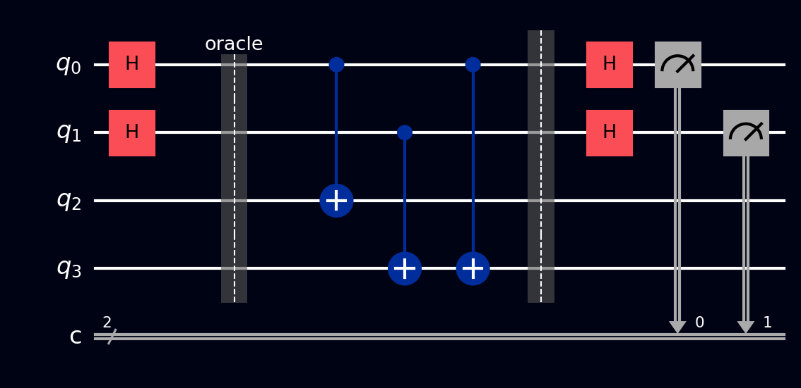

# Simon's algorithm

Simon's algorithm finds a hidden XOR-mask **exponentially** faster than any classical method - not "somewhat faster" like [Deutsch-Jozsa](deutsch-jozsa.md) or [Bernstein-Vazirani](bernstein-vazirani.md), but the difference between a handful of queries and more queries than the universe has time for. Historically, this was the result that inspired Shor to build [his factoring algorithm](shors.md): both are, at heart, period-finding algorithms.

## Why this exists

The game: a mystery function \( f \) maps \( n \)-bit strings to \( n \)-bit strings, with a **promise**: there's a secret nonzero string \( s \) such that

\[ f(x) = f(y) \quad \text{exactly when} \quad y = x \oplus s \]

So \( f \) is two-to-one: the inputs pair up (each \( x \) with its partner \( x \oplus s \)), and each pair shares one output value. You could call \( s \) a *period*, but with respect to XOR instead of ordinary addition: shifting the input by \( s \) (in the XOR sense) leaves the output unchanged. Your job is to find \( s \).

Classically this is brutally hard. The only way to learn anything is to find a **collision** - two inputs with the same output - and until you stumble on one, the outputs look like random noise. By the birthday-paradox argument you need around \( \sqrt{2^n} = 2^{n/2} \) queries. For \( n = 128 \), that's \( 2^{64} \) function calls.

Simon's algorithm needs about **\( n \) queries**. For \( n = 128 \): roughly 128 calls plus a bit of high-school-style algebra. That's an exponential separation, proven, and it was the first of its kind.

## What you need to know first

- **Oracles and how quantum circuits package functions** - covered in [Deutsch-Jozsa: what an oracle is](deutsch-jozsa.md#what-an-oracle-is). One difference here: the output register is \( n \) bits wide, not a single ancilla, and there's no \( |-\rangle \) trick - Simon's uses the output register in the plain "write the answer" way.
- **XOR as bitwise addition mod 2** - Khan Academy's [XOR primer](https://www.khanacademy.org/computing/computer-science/cryptography/ciphers/a/xor-bitwise-operation).
- **The Hadamard identity** \( H^{\otimes n}|x\rangle = \frac{1}{\sqrt{2^n}}\sum_y (-1)^{x \cdot y}|y\rangle \) - introduced on the [Bernstein-Vazirani](bernstein-vazirani.md#what-you-need-to-know-first) page.
- **Solving small systems of linear equations** - the classical post-processing step. Same idea as ordinary [systems of equations](https://www.khanacademy.org/math/algebra/x2f8bb11595b61c86:systems-of-equations), except every number is 0 or 1 and addition is XOR.

## How it works, step by step

Two registers of \( n \) qubits each: input and output. Each run of the circuit:

1. **Superpose the inputs:** H on every input qubit.
2. **One oracle call:** compute \( f \) into the output register: \( \sum_x |x\rangle|f(x)\rangle \). The two registers are now entangled.
3. **Forget the output:** measure (or simply ignore) the output register. Whatever value \( f(x_0) \) it shows, the input register collapses to the two partners that share it:

    \[ \frac{|x_0\rangle + |x_0 \oplus s\rangle}{\sqrt{2}} \]

    The secret is now *inside* the input register - as the difference between two superposed strings - but measuring right away would just give a random one of the two and teach you nothing.

4. **Interfere:** H on every input qubit.
5. **Measure the input register.** The result is a random string \( y \) satisfying

    \[ y \cdot s = 0 \pmod 2 \]

    One run gives one equation constraining \( s \). It doesn't reveal \( s \), but it cuts the possibilities in half.

6. **Repeat and solve (classical part):** run the circuit until you've collected \( n - 1 \) independent equations, then solve the linear system mod 2 for \( s \). On average this takes only a little over \( n \) runs.

## The math

Why does step 5 only ever produce \( y \) with \( y \cdot s = 0 \)? Apply the Hadamard identity to the collapsed state from step 3. The amplitude landing on \( |y\rangle \) is proportional to

\[ (-1)^{x_0 \cdot y} + (-1)^{(x_0 \oplus s) \cdot y} = (-1)^{x_0 \cdot y}\left(1 + (-1)^{s \cdot y}\right) \]

- If \( s \cdot y = 1 \): the bracket is \( 1 - 1 = 0 \). That outcome is *impossible* - the two paths cancel exactly.
- If \( s \cdot y = 0 \): the bracket is \( 2 \). Those outcomes survive, all equally likely.

Interference doesn't hand you \( s \) directly; it hands you a perfectly clean *constraint* on \( s \), every single run. The randomness (which \( y \) you get) is harmless; the guarantee (\( y \cdot s = 0 \)) is what you keep.

## A worked example

Take \( n = 2 \), secret \( s = 11 \), and \( f(x_1 x_0) = x_1 \oplus x_0 \) written into a single output bit (for \( n = 2 \) a 1-bit output is enough). Check the promise: \( f(00) = f(11) = 0 \) and \( f(01) = f(10) = 1 \) - inputs pair up exactly by \( \oplus 11 \). The oracle is two [CNOTs](../gates/cnot.md): `q[0]` → `q[2]` and `q[1]` → `q[2]`.

Run the circuit. Suppose the output register measures 0: the input register collapses to \( \frac{|00\rangle + |11\rangle}{\sqrt{2}} \). After the final Hadamards (do the algebra or trust the boxed formula), only \( |00\rangle \) and \( |11\rangle \) remain possible - both satisfy \( y \cdot 11 = 0 \), since \( y_1 \oplus y_0 = 0 \) for both.

Now the classical step. The outcome \( y = 00 \) is the trivial equation "0 = 0" and teaches nothing; keep sampling until you get \( y = 11 \), which says \( s_1 \oplus s_0 = 0 \), i.e. the secret's two bits are equal. Combined with the promise \( s \neq 00 \), the only option left is \( s = 11 \). Found it.

## The circuit

For the \( n = 2 \), \( s = 11 \) example, build on 3 qubits (`q[0]`, `q[1]` input; `q[2]` output), or load it from the [Ready algorithms](../tour/drag-drop/operations.md#switching-to-ready-algorithms) panel:

1. H on `q[0]` and `q[1]`
2. **Oracle:** CNOT `q[0]` → `q[2]`, CNOT `q[1]` → `q[2]`
3. [Measure](../gates/measurement.md) `q[2]` (optional - discarding it works too)
4. H on `q[0]` and `q[1]`
5. Measure `q[0]` and `q[1]` - you'll only ever see `00` or `11`, each about half the time; `01` and `10` never appear

References for the circuit layout: [Wikipedia: Simon's problem](https://en.wikipedia.org/wiki/Simon%27s_problem) and [IBM Quantum Learning: Quantum query algorithms](https://learning.quantum.ibm.com/course/fundamentals-of-quantum-algorithms/quantum-query-algorithms).

## The circuit in code



The \( n = 2 \), \( s = 11 \) circuit (4 qubits: 2 input + 2 output). [Barriers](../gates/barrier.md) separate the three phases: superpose inputs, oracle, and interference + measurement.

=== "OpenQASM 2.0"

    ```qasm
    OPENQASM 2.0;
    include "qelib1.inc";

    qreg q[3];
    creg c[2];

    // Superpose the input register
    h q[0];
    h q[1];
    barrier q;

    // Oracle: f(x) = x0 XOR x1 (two-to-one with mask s = 11)
    cx q[0], q[2];
    cx q[1], q[2];
    barrier q;

    // Interfere and measure input register only
    h q[0];
    h q[1];
    measure q[0] -> c[0];
    measure q[1] -> c[1];
    ```

=== "OpenQASM 3.0"

    ```qasm
    OPENQASM 3.0;
    include "stdgates.inc";

    qubit[3] q;
    bit[2] c;

    // Superpose the input register
    h q[0];
    h q[1];
    barrier q;

    // Oracle: f(x) = x0 XOR x1
    cx q[0], q[2];
    cx q[1], q[2];
    barrier q;

    // Interfere and measure input register only
    h q[0];
    h q[1];
    c[0] = measure q[0];
    c[1] = measure q[1];
    ```

=== "Qiskit"

    ```python
    from qiskit import QuantumCircuit
    from qiskit_aer import AerSimulator

    n = 2                      # input size; secret s = 11
    qc = QuantumCircuit(n + 1, n)

    # All inputs in superposition — one oracle call covers all 2^n inputs
    qc.h(range(n))
    qc.barrier()

    # Oracle: f(x) = x0 XOR x1 (two-to-one with mask s = 11).
    # No |-> ancilla trick — the answer is genuinely written into q[2],
    # and it's the resulting entanglement that does the work.
    qc.cx(0, n)
    qc.cx(1, n)
    qc.barrier()

    # Output register isn't measured — discarding an entangled register
    # has the same collapsing effect as measuring it
    qc.h(range(n))
    qc.measure(range(n), range(n))

    # Only 00 and 11 appear (~50/50); 01 and 10 are killed by interference.
    # Collect n-1 independent nonzero results, solve mod-2 to recover s.
    counts = AerSimulator().run(qc, shots=1024).result().get_counts()
    print(counts)
    ```

=== "Cirq"

    ```python
    import cirq

    q = cirq.LineQubit.range(3)

    circuit = cirq.Circuit()
    # Superpose the input register
    circuit.append(cirq.H(q[0]))
    circuit.append(cirq.H(q[1]))
    circuit.append(cirq.ops.Moment())  # barrier

    # Oracle: f(x) = x0 XOR x1
    circuit.append(cirq.CNOT(q[0], q[2]))
    circuit.append(cirq.CNOT(q[1], q[2]))
    circuit.append(cirq.ops.Moment())  # barrier

    # Interfere and measure input register only
    circuit.append(cirq.H(q[0]))
    circuit.append(cirq.H(q[1]))
    circuit.append(cirq.measure(q[0], q[1], key='result'))
    print(circuit)
    ```

=== "Q#"

    ```qsharp
    namespace QompileCircuit {
        open Microsoft.Quantum.Canon;
        open Microsoft.Quantum.Intrinsic;

        operation Circuit() : Result[] {
            use q = Qubit[3];
            mutable c = [Zero, size = 2];

            // Superpose the input register
            H(q[0]);
            H(q[1]);

            // Oracle: f(x) = x0 XOR x1
            CNOT(q[0], q[2]);
            CNOT(q[1], q[2]);

            // Interfere and measure input register only
            H(q[0]);
            H(q[1]);
            set c w/= 0 <- M(q[0]);
            set c w/= 1 <- M(q[1]);

            ResetAll(q);
            return c;
        }
    }
    ```

## What you'll see

- **[Probabilities](../tour/visualizations/probabilities.md)** - only the outcomes with \( y \cdot s = 0 \) appear, all equal; the forbidden half of the histogram is exactly empty.
- **[Q-Sphere](../tour/visualizations/q-sphere.md)** - after the oracle, the entangled input-output state shows four branches; after the final Hadamards, only the allowed \( y \) values remain.
- **[Statevector](../tour/visualizations/statevector.md)** - the cancellations are visible directly: amplitudes on \( y \cdot s = 1 \) outcomes are exactly zero, not just small.
