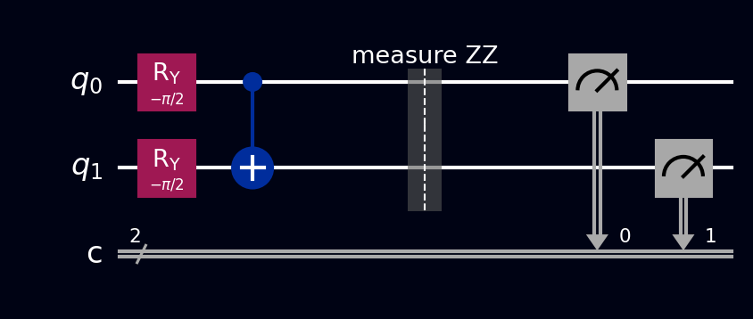

# VQE

The **Variational Quantum Eigensolver** estimates the lowest energy state of a molecule or quantum system - its *ground state* - by teaming a short, tunable quantum circuit with an ordinary classical optimizer. It's the flagship quantum chemistry algorithm for today's noisy hardware, and the sister algorithm of [QAOA](qaoa.md): same hybrid quantum-classical loop, aimed at physics instead of optimization.

## Why this exists

An enormous amount of chemistry and materials science boils down to one number: the ground-state energy. It decides which molecules are stable, how fast reactions run, how strongly a drug candidate binds to its target, whether a material superconducts. And computing it classically gets exponentially harder as molecules grow, because the number of quantum configurations to track doubles with every orbital - this is precisely the problem that made Feynman propose quantum computers in the first place: simulate quantum systems *with* a quantum system.

[QPE](qpe.md) can extract these energies with textbook precision, but it demands long circuits and error-corrected hardware that doesn't exist yet. VQE (introduced in 2014) makes the opposite trade: many *short* circuit runs, with a classical optimizer doing the heavy lifting between them. Short circuits survive noise, which is why VQE became the standard near-term approach.

## What you need to know first

### Hamiltonians

A **Hamiltonian** \( H \) is the operator that represents a system's total energy - think of it as the quantum score sheet, as on the [QAOA page](qaoa.md). Its **eigenvalues** are the energies the system is allowed to have, its eigenvectors are the corresponding states, and the smallest eigenvalue \( E_0 \) with its eigenvector is the ground state. On a quantum computer, any Hamiltonian is written as a weighted sum of **Pauli strings** - products of [X](../gates/pauli-x.md), [Y](../gates/pauli-y.md), [Z](../gates/pauli-z.md), and identity gates, like \( 0.5\, Z \otimes Z \) or \( 0.3\, X \otimes I \).

### Eigenvectors and eigenvalues

Explained from scratch, with Khan Academy links, in [QPE: what you need to know first](qpe.md#eigenvectors-and-eigenvalues). The one-line recap: an eigenvector of an operator is a state the operator only *scales*, and the scale factor is its eigenvalue.

### Expectation values

\( \langle H \rangle = \langle\psi|H|\psi\rangle \) sounds intimidating but is just the **average energy** you'd record by measuring the state \( |\psi\rangle \) many times. Because \( H \) is a sum of Pauli strings, the average is computed term by term: estimate \( \langle Z Z \rangle \), \( \langle X X \rangle \), etc. from measurement counts, then add them up with their weights.

### The variational principle

The theorem that makes VQE safe: for *every* possible state \( |\psi\rangle \),

\[ \langle\psi|H|\psi\rangle \;\ge\; E_0 \]

with equality exactly when \( |\psi\rangle \) is the ground state. No trial state can ever cheat below the true answer, so "find the ground state" becomes a pure minimization problem: tune the state, push the average energy down, and every improvement is real progress toward \( E_0 \). This is the "variational" in the name.

### The ansatz

An **ansatz** (German for "starting approach") is a circuit with tunable knobs - rotation angles - that generates a family of trial states. Picking one is a balancing act: expressive enough that the ground state (or something close) is reachable at *some* knob setting, shallow enough to run reliably on noisy hardware.

### Measuring X and Y

Hardware only measures in the Z basis (0 or 1). To measure an \( X \) term, rotate first with an [H](../gates/hadamard.md); for a \( Y \) term, apply [S†](../gates/s-dagger.md) then H. After the rotation, an ordinary measurement of Z reads out the X or Y information.

## How it works, step by step

1. **Encode the problem** as a Hamiltonian \( H = \sum_k c_k P_k \), a weighted sum of Pauli strings. (For real molecules this comes from mapping electrons and orbitals onto qubits, e.g. the Jordan-Wigner transformation; the weights \( c_k \) are computed classically beforehand.)
2. **Choose an ansatz** circuit \( U(\theta) \).
3. **Evaluate the energy at the current knobs:** prepare \( |\psi(\theta)\rangle = U(\theta)|0\ldots0\rangle \), measure each Pauli term with its basis rotation over many shots, and combine into \( E(\theta) = \sum_k c_k \langle P_k \rangle \).
4. **Classical step:** an optimizer proposes new knob settings to lower \( E(\theta) \).
5. **Loop** steps 3-4 until the energy stops improving. The minimum found is the ground-state energy estimate, and the circuit at those knobs prepares the ground state itself.

## The math

The variational principle takes three lines to prove. Expand any trial state in the eigenbasis of \( H \) (eigenstates \( |e_i\rangle \) with energies \( E_i \ge E_0 \)):

\[ |\psi\rangle = \sum_i c_i |e_i\rangle \quad\Longrightarrow\quad \langle\psi|H|\psi\rangle = \sum_i |c_i|^2 E_i \;\ge\; E_0 \sum_i |c_i|^2 = E_0 \]

The average of a set of energies can't be lower than the smallest one. That's the entire safety guarantee of VQE.

## A worked example

Take two qubits with the Hamiltonian

\[ H = X \otimes X + Y \otimes Y + Z \otimes Z \]

This is the **Heisenberg exchange interaction**, the actual physics of how two neighboring electron spins couple inside a magnet. Its eigenvalues are \( +1 \) (three states) and \( E_0 = -3 \) (exactly one state), and the ground state is an old friend: the singlet \( |\Psi^-\rangle = \tfrac{1}{\sqrt{2}}(|01\rangle - |10\rangle) \) from the [Bell states](bell-states.md) page.

There's a built-in lesson here: the best *unentangled* state only reaches \( \langle H \rangle = -1 \). An ansatz without an entangling gate will plateau there forever, no matter how hard the optimizer works - reaching \( -3 \) requires entanglement. VQE makes "entanglement is a real, measurable resource" something you can watch happen.

Use this ansatz: **X on `q[1]`**, then **RY(\( \theta \)) on `q[0]`**, then **CNOT `q[0]`→`q[1]`**. It's the Bell-state recipe with the Hadamard swapped for a tunable [RY](../gates/ry-gate.md) rotation, and it prepares

\[ |\psi(\theta)\rangle = \cos\tfrac{\theta}{2}\,|01\rangle + \sin\tfrac{\theta}{2}\,|10\rangle \]

The three terms work out to \( \langle ZZ \rangle = -1 \) always (the qubits always disagree), and \( \langle XX \rangle = \langle YY \rangle = \sin\theta \), so the energy has a clean closed form:

\[ E(\theta) = 2\sin\theta - 1 \]

At \( \theta = 0 \) the state is the product state \( |01\rangle \) with \( E = -1 \), the unentangled floor. The optimizer slides \( \theta \) down to \( -\tfrac{\pi}{2} \), where \( E = -3 \) and the prepared state is exactly \( |\Psi^-\rangle \).

## The circuit

At the optimum \( \theta = -\tfrac{\pi}{2} \), each Hamiltonian term gets its own measurement circuit. All three share the same preparation - **X** on `q[1]`, **RY(\( -\pi/2 \))** on `q[0]`, **CNOT** from `q[0]` to `q[1]` - and differ only in the rotation before the final [measurement](../gates/measurement.md):

1. **ZZ circuit:** preparation, then measure both qubits
2. **XX circuit:** preparation, then H on both qubits, then measure both
3. **YY circuit:** preparation, then S† on both qubits, then H on both, then measure both

Each of the three gives perfectly anticorrelated 50/50 outcomes (`01` and `10`), so each term contributes \( -1 \), totalling \( E = -3 \). Or load VQE from the [Ready algorithms](../tour/drag-drop/operations.md#switching-to-ready-algorithms) panel.

References for the circuit layout: [Wikipedia: Variational quantum eigensolver](https://en.wikipedia.org/wiki/Variational_quantum_eigensolver) and [IBM Quantum Learning: Variational algorithm design](https://learning.quantum.ibm.com/course/variational-algorithm-design).

## The circuit in code



The ZZ measurement circuit at the optimal angle \( \theta = -\pi/2 \). [Barriers](../gates/barrier.md) separate the ansatz (state preparation) from the measurement. For the XX and YY circuits, add the appropriate basis rotations between the barrier and the measurement (see [The circuit](#the-circuit) above).

=== "OpenQASM 2.0"

    ```qasm
    OPENQASM 2.0;
    include "qelib1.inc";

    qreg q[2];
    creg c[2];

    // Ansatz: prepare the trial state
    x q[1];
    ry(-pi/2) q[0];
    cx q[0], q[1];
    barrier q;

    // ZZ measurement (no basis rotation needed)
    measure q -> c;
    ```

=== "OpenQASM 3.0"

    ```qasm
    OPENQASM 3.0;
    include "stdgates.inc";

    qubit[2] q;
    bit[2] c;

    // Ansatz: prepare the trial state
    x q[1];
    ry(-pi/2) q[0];
    cx q[0], q[1];
    barrier q;

    // ZZ measurement
    c = measure q;
    ```

=== "Qiskit"

    ```python
    from qiskit import QuantumCircuit
    from qiskit_aer import AerSimulator
    from scipy.optimize import minimize

    sim = AerSimulator()

    def ansatz(theta):
        """Tunable Bell-state recipe: at theta = -pi/2 this is |Psi->."""
        qc = QuantumCircuit(2)
        qc.x(1)
        qc.ry(theta, 0)
        qc.cx(0, 1)
        return qc

    def measure_term(theta, basis):
        """Measure one Pauli term. H rotates X->Z; Sdg+H rotates Y->Z."""
        qc = ansatz(theta)
        if basis == "XX":
            qc.h([0, 1])
        elif basis == "YY":
            qc.sdg([0, 1])
            qc.h([0, 1])
        qc.measure_all()
        counts = sim.run(qc, shots=2048).result().get_counts()
        # Parity trick: even number of 1s -> +1, odd -> -1
        signed = sum(shots if bits.count("1") % 2 == 0 else -shots
                     for bits, shots in counts.items())
        return signed / 2048

    def energy(params):
        return sum(measure_term(params[0], b) for b in ["XX", "YY", "ZZ"])

    # Expected output: theta ~ -1.57, energy ~ -3
    result = minimize(energy, x0=[0.1], method="COBYLA")
    print("theta =", result.x[0], " energy =", result.fun)
    ```

=== "Cirq"

    ```python
    import cirq
    import numpy as np

    q = cirq.LineQubit.range(2)

    circuit = cirq.Circuit()
    # Ansatz: prepare the trial state
    circuit.append(cirq.X(q[1]))
    circuit.append(cirq.ry(-np.pi / 2).on(q[0]))
    circuit.append(cirq.CNOT(q[0], q[1]))
    circuit.append(cirq.ops.Moment())  # barrier

    # ZZ measurement
    circuit.append(cirq.measure(*q, key='result'))
    print(circuit)
    ```

=== "Q#"

    ```qsharp
    namespace QompileCircuit {
        open Microsoft.Quantum.Canon;
        open Microsoft.Quantum.Intrinsic;
        open Microsoft.Quantum.Math;

        operation Circuit() : Result[] {
            use q = Qubit[2];
            mutable c = [Zero, size = 2];

            // Ansatz: prepare the trial state
            X(q[1]);
            Ry(-PI() / 2.0, q[0]);
            CNOT(q[0], q[1]);

            // ZZ measurement
            set c w/= 0 <- M(q[0]);
            set c w/= 1 <- M(q[1]);

            ResetAll(q);
            return c;
        }
    }
    ```

## What you'll see

- **[Probabilities](../tour/visualizations/probabilities.md)** - at the optimum, two 50% bars on `01` and `10` in the ZZ circuit - and the *same* anticorrelated pattern in the XX and YY circuits. Only the entangled singlet disagrees in every measurement basis at once; no product state can do that.
- **[Q-Sphere](../tour/visualizations/q-sphere.md)** - on the bare preparation circuit: two points with opposite phase colors, the literal \( |\Psi^-\rangle \) picture from the Bell states page. At \( \theta = 0 \), a single point on \( |01\rangle \) - watch entanglement appear as you tune the knob.
- **[Statevector](../tour/visualizations/statevector.md)** - two amplitudes of magnitude ≈0.707 with opposite signs on \( |01\rangle \) and \( |10\rangle \) at the optimum; at intermediate \( \theta \), unequal magnitudes that show the optimizer partway through its journey.
