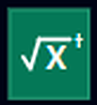

# √X†

{ .gate-tile }

**√X†** is the inverse of [√X](sqrt-x.md) - applying √X then √X† (in either order) returns a qubit exactly to its starting state.

| | |
|---|---|
| **Qubits** | 1 |
| **Parameters** | None |
| **Inverse** | [√X](sqrt-x.md) |
| **Also called** | SX-dagger, adjoint of SX |

## What it does

√X† applies the complex-conjugate transpose of √X's matrix, undoing its effect.

## Matrix

\[
\sqrt{X}^\dagger = \frac{1}{2}\begin{pmatrix} 1-i & 1+i \\ 1+i & 1-i \end{pmatrix}
\]

## Action on basis states

- \( |0\rangle \rightarrow \dfrac{1}{2}\big[(1-i)|0\rangle + (1+i)|1\rangle\big] \)
- \( |1\rangle \rightarrow \dfrac{1}{2}\big[(1+i)|0\rangle + (1-i)|1\rangle\big] \)

## Other notations

Naming conventions across ecosystems; exact syntax can vary by library version, and this does not claim to be Qompile's generated output unless otherwise noted.

| Language | Typical form |
|---|---|
| OpenQASM 2.0 | `sxdg q[0];` |
| Qiskit | `circuit.sxdg[q[0]]` |
| Cirq | `cirq.X(q[0])**-0.5` |
| Q# | - |

## Related

- [√X](sqrt-x.md)
