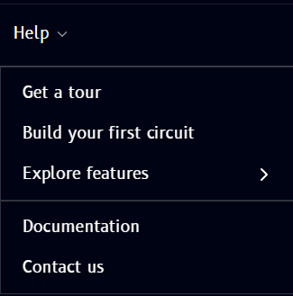
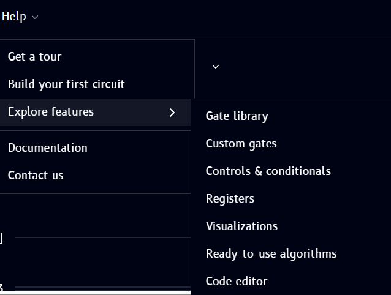

# Help

The **Help** menu sits in the **top bar**, in the row of File / Edit / View menus, right after **View** (see [region 1 in the Tour of Qompile](tour/overview.md)). Clicking it opens a dropdown that's your entry point to onboarding and support resources:

| Item | What it does |
|---|---|
| Get a tour | Launches a guided walkthrough of the Qompile interface |
| Build your first circuit | A guided tutorial for creating your first circuit |
| Explore features | Opens a submenu linking to feature-specific guides (see below) |
| Documentation | Opens this documentation site |
| Contact us | Reach out to the Qompile team for support |

## Explore features submenu

Hovering **Explore features** opens a submenu with quick links to specific topics:

- **Gate library** - the [Operations](tour/drag-drop/operations.md) catalog, or the full [Gate reference](gates/index.md)
- **Custom gates**
- **Controls & conditionals** - see [Controls and conditionals](gates/controls-and-conditionals.md)
- **Registers**
- **Visualizations**
- **Ready-to-use algorithms** - see [Ready algorithms](algorithms/overview.md)
- **Code editor** - see [Build with code](tour/code/openqasm.md)
