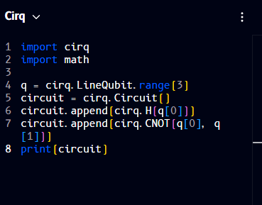

# Cirq

**Cirq** is Google Quantum AI's open-source Python framework for writing, manipulating, and running quantum circuits. It's built with today's noisy, intermediate-scale quantum hardware in mind, giving you fine-grained control over things like qubit layout and gate timing, and it can run circuits on Google's own quantum processors as well as on built-in simulators (including `qsim`, a high-performance wavefunction simulator).

The code panel can also render your circuit as Cirq. Here's the same H + CNOT circuit rendered as Cirq:



```python
import cirq
import math

q = cirq.LineQubit.range[3]
circuit = cirq.Circuit[]
circuit.append[cirq.H[q[0]]]
circuit.append[cirq.CNOT[q[0], q[1]]]
print[circuit]
```

!!! note "Square brackets, not parentheses"
    As with the [Qiskit](qiskit.md) view, Qompile's Cirq output uses square brackets for calls (e.g. `cirq.Circuit[]`, `print[circuit]`) rather than the parentheses used in standard Cirq (`cirq.Circuit()`, `print(circuit)`). Convert brackets to parentheses if running this code outside Qompile.

For the full API reference and guides on running circuits on real hardware or simulators, see the official [Cirq documentation](https://quantumai.google/cirq).

---

Continue to: [Q#](qsharp.md)
