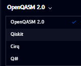
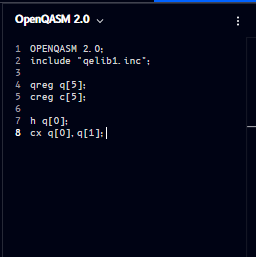

# Build your circuit with code

Alongside the drag-and-drop canvas, Qompile shows a **live code panel** that reflects your circuit in real time - build visually and read the code, or edit the code directly and watch the circuit update.

!!! important "Two-way sync"
    The code panel and the [Circuit](../drag-drop/circuit.md) canvas are fully synced in **both directions**, for all four supported languages:

    - Dragging and dropping gates on the circuit canvas updates the code instantly
    - Editing the code directly (in OpenQASM, Qiskit, Cirq, or Q#) updates the circuit diagram instantly

    This means you can freely switch between building visually and writing code, even mid-circuit, without losing anything.

## Language switcher

Click the language name at the top of the code panel to switch between supported languages:



Supported languages:

- **OpenQASM 2.0**
- **Qiskit**
- **Cirq**
- **Q#**

## OpenQASM

By default, the panel shows **OpenQASM 2.0**. A circuit with an H gate and a CNOT looks like this:



```qasm
OPENQASM 2.0;
include "qelib1.inc";

qreg q[5];
creg c[5];

h q[0];
cx q[0], q[1];
```

- `qreg` / `creg` declare the quantum and classical registers, matching what's set up in [Manage registers](../drag-drop/circuit.md#managing-registers)
- Each subsequent line is one operation, in the order it appears on the circuit (`h` = Hadamard, `cx` = CNOT)
- The **⋮** menu (top-right of the panel) provides additional options for the code view

---

Continue to: [Qiskit](qiskit.md) · [Cirq](cirq.md) · [Q#](qsharp.md)
