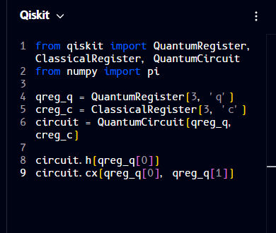

# Qiskit

**Qiskit** is IBM's open-source Python SDK for quantum computing, one of the most widely used quantum programming toolkits. It lets you build circuits as Python objects (`QuantumCircuit`), run them on local simulators, or submit them to real IBM Quantum hardware over the cloud. Beyond just circuit construction, the broader Qiskit ecosystem includes tools for optimization, error mitigation, and transpiling circuits down to what specific hardware can run.

The code panel can also render your circuit as Qiskit. Here's the same H + CNOT circuit shown in [OpenQASM](openqasm.md) rendered as Qiskit:



```python
from qiskit import QuantumRegister, ClassicalRegister, QuantumCircuit
from numpy import pi

qreg_q = QuantumRegister(3, 'q')
creg_c = ClassicalRegister(3, 'c')
circuit = QuantumCircuit(qreg_q, creg_c)

circuit.h(qreg_q[0])
circuit.cx(qreg_q[0], qreg_q[1])
```

!!! note "Why the parentheses can look like brackets"
    This site's code font (B612 Mono) draws `(` and `)` with a fairly square, angular shape, so at a glance they can look like `[` and `]`. The code above is ordinary Qiskit with real parentheses for calls - only the actual index brackets, like the `[0]` in `qreg_q[0]`, are square brackets.

To go deeper than what Qompile shows, install the SDK, run circuits on real hardware, or look up specific gates and functions, see the official [Qiskit documentation](https://docs.quantum.ibm.com/).

---

Continue to: [Cirq](cirq.md) · [Q#](qsharp.md)
