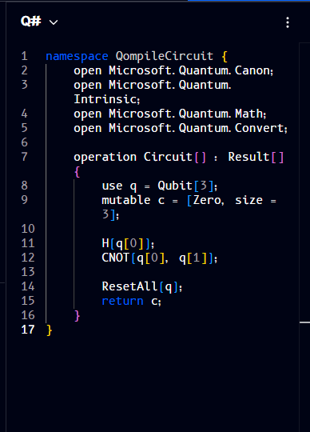

# Q#

**Q#** (pronounced "Q sharp") is Microsoft's domain-specific programming language for quantum computing, part of the Quantum Development Kit (QDK). Unlike Qiskit or Cirq, which are Python libraries for describing circuits, Q# is its own language with quantum-specific syntax built in from the ground up (qubit allocation, operations, and control flow as first-class language features). It integrates with Azure Quantum to run on cloud simulators and partner quantum hardware.

The code panel can also render your circuit as Q#. Here's the same H + CNOT circuit rendered as Q#:



```qsharp
namespace QompileCircuit {
    open Microsoft.Quantum.Canon;
    open Microsoft.Quantum.Intrinsic;
    open Microsoft.Quantum.Math;
    open Microsoft.Quantum.Convert;

    operation Circuit() : Result[] {
        use q = Qubit[3];
        mutable c = [Zero, size = 3];

        H(q[0]);
        CNOT(q[0], q[1]);

        ResetAll(q);
        return c;
    }
}
```

Like the [Qiskit](qiskit.md) and [Cirq](cirq.md) views, this is standard Q# syntax - parentheses for function calls (`H(q[0])`) and square brackets only where Q# itself uses them (array types and indexing, e.g. `Qubit[3]`, `q[0]`).

To install the QDK, set up Azure Quantum, or look up the standard operations library, see the official [Q# and Azure Quantum documentation](https://learn.microsoft.com/en-us/azure/quantum/).
