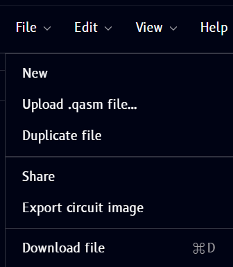
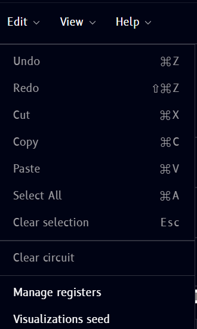
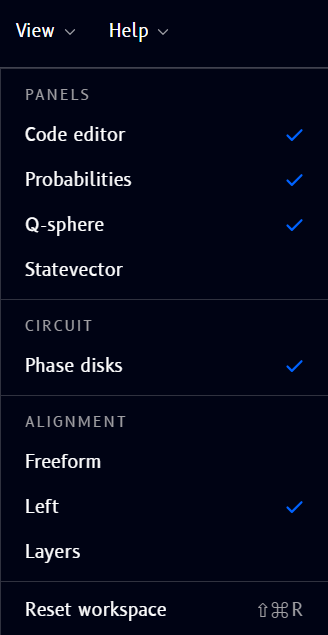

# Customizing your circuit

## Name

Click the circuit's name (shown as **"Untitled circuit"** by default, in the top bar) to rename it. It becomes an editable text field with confirm and cancel controls:

- Type the new name, then either:
    - Click the **checkmark** (or press **Enter**) to confirm the new name
    - Click the **X** (or press **Escape**) to cancel and keep the previous name

## File / Edit / View dropdowns

Three menus in the top bar give you file management, editing, and workspace controls.

### File

{ .doc-image--portrait }

| Item | What it does |
|---|---|
| New | Start a new, blank circuit |
| Upload .qasm file... | Import a circuit from an OpenQASM file |
| Duplicate file | Create a copy of the current circuit |
| Share | Share the circuit with others |
| Export circuit image | Save the circuit diagram as an image |
| Download file | Download the circuit file (⌘D) |

### Edit

{ .doc-image--portrait }

| Item | Shortcut | What it does |
|---|---|---|
| Undo | ⌘Z | Undo the last action |
| Redo | ⇧⌘Z | Redo the last undone action |
| Cut | ⌘X | Cut the selected operation(s) |
| Copy | ⌘C | Copy the selected operation(s) |
| Paste | ⌘V | Paste previously cut/copied operation(s) |
| Select All | ⌘A | Select every operation on the circuit |
| Clear selection | Esc | Deselect everything |
| Clear circuit | - | Remove all operations from the circuit |
| Manage registers | - | Add, remove, or edit quantum/classical registers - see [Circuit → Managing registers](drag-drop/circuit.md#managing-registers) |
| Visualizations seed | - | Set the seed used for Q-Sphere/Statevector randomness - see [Circuit → Visualizations seed](drag-drop/circuit.md#visualizations-seed) |

!!! note
    Undo/redo, cut/copy/paste, and register management are also covered in more depth on the [Circuit](drag-drop/circuit.md) page - this menu is just the entry point for those actions.

### View

{ .doc-image--portrait }

Controls which panels are visible and how the circuit is arranged:

- **Panels** - toggle **Code editor**, **Probabilities**, **Q-sphere**, and **Statevector** on/off
- **Circuit** - toggle **Phase disks** on/off
- **Alignment** - switch between **Freeform**, **Left**, and **Layers** layout modes
- **Reset workspace** (⇧⌘R) - restore the default panel layout

