# Circuit

The **Circuit** panel is the canvas where you assemble your program - quantum and classical registers laid out as horizontal wires, with gates dropped onto them.

!!! important "Synced with the code panel"
    Everything you do here is mirrored live in the [code panel](../code/openqasm.md), and vice versa - edits in OpenQASM, Qiskit, Cirq, or Q# update this canvas instantly, in both directions.

## Quantum and classical registers

Every circuit starts with a set of **quantum registers** (labeled `q[0]`, `q[1]`, ...) and **classical registers** (labeled `c0`, `c1`, ... or grouped, e.g. `c6`):

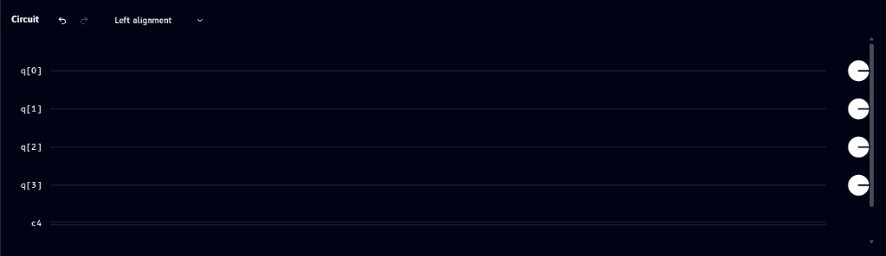

By default, each quantum wire ends in a small circle marker on the right - this is the **default measurement/readout marker**, shown on every wire whether or not you've explicitly added a measurement operation.

### Managing registers

Open **Manage registers** from the Edit menu to add, rename, resize, or delete registers:

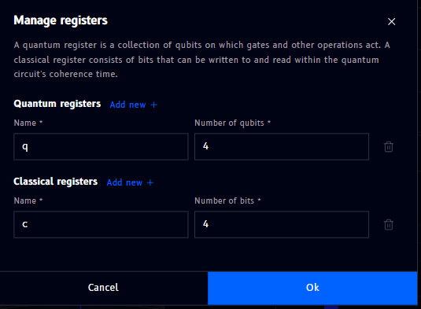

- **Quantum registers** - set a name and the number of qubits
- **Classical registers** - set a name and the number of bits
- Click **Add new +** to create another register of that type
- Click the trash icon to delete a register
- **Ok** applies changes, **Cancel** discards them

## Dropping operations

Drag a gate from the [Operations](operations.md) panel onto a register wire to place it. Once dropped, the gate appears as a colored tile directly on the wire. Not sure what a gate actually does? Every gate has its own page in the [Gate reference](../../gates/index.md).

![H gate placed on q[0]](../../images/circuit/gate-placed.png)

## Editing, viewing info, and other gate actions

Click a placed gate to select it and reveal a small action toolbar above it:

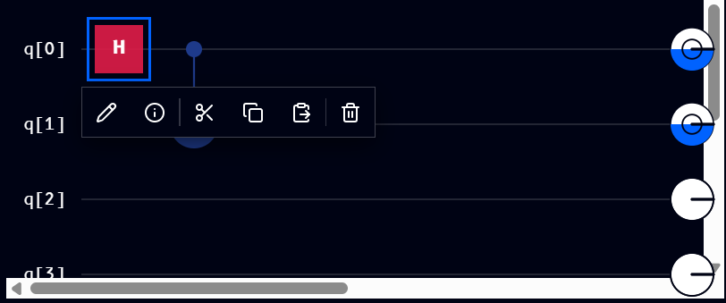

From left to right, the toolbar offers:

| Icon | Action |
|---|---|
| Pencil | **Edit** the gate (e.g. change a rotation angle) |
| (i) | **Info** - view details about the gate |
| Scissors | **Cut** |
| Two overlapping squares | **Copy** |
| Square with arrow | **Paste** |
| Trash | **Delete** |

Hovering over an icon shows its label, e.g. hovering the pencil shows **Edit**:

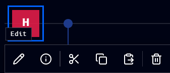

### Gate info panel

Selecting a gate and choosing **Info** opens details in the Operations panel - the gate's name, how many qubits it acts on, and a description of what it does:

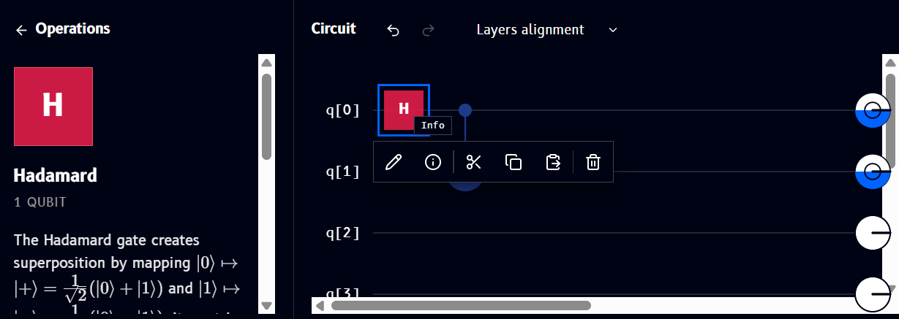

## Multi-qubit gate symbols

Some gates span more than one wire and are drawn as connected symbols rather than a single tile. Here's a [CNOT](../../gates/cnot.md), connecting `q[1]` (control) to `q[2]` (target):


- **[CNOT](../../gates/cnot.md)** - a solid dot on the control wire, connected by a vertical line to a circled **+** on the target wire
- **[SWAP](../../gates/swap.md)** - an **✕** mark on each of the two wires being swapped, connected by a vertical line

The same control-dot symbol is also used by [Toffoli](../../gates/toffoli.md) (two control dots) and by the standalone [Control](../../gates/control.md) tile for building custom controlled gates.

## Alignment modes

The dropdown next to the undo/redo arrows (top of the Circuit panel) controls how gates are laid out:

### Left alignment


Gates are moved as far left as their order and multi-qubit connections allow, producing a compact circuit.

### Layers alignment

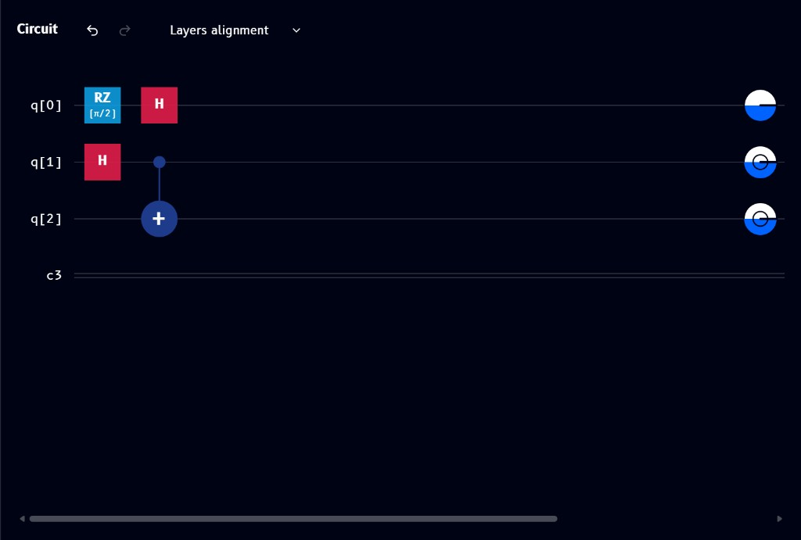

Gates are grouped into vertical execution layers. Gates that can run at the same stage share a column, so the circuit's sequence is easier to read. Unlike Left alignment, this mode prioritizes visible execution stages over using the least horizontal space.

### Freeform alignment

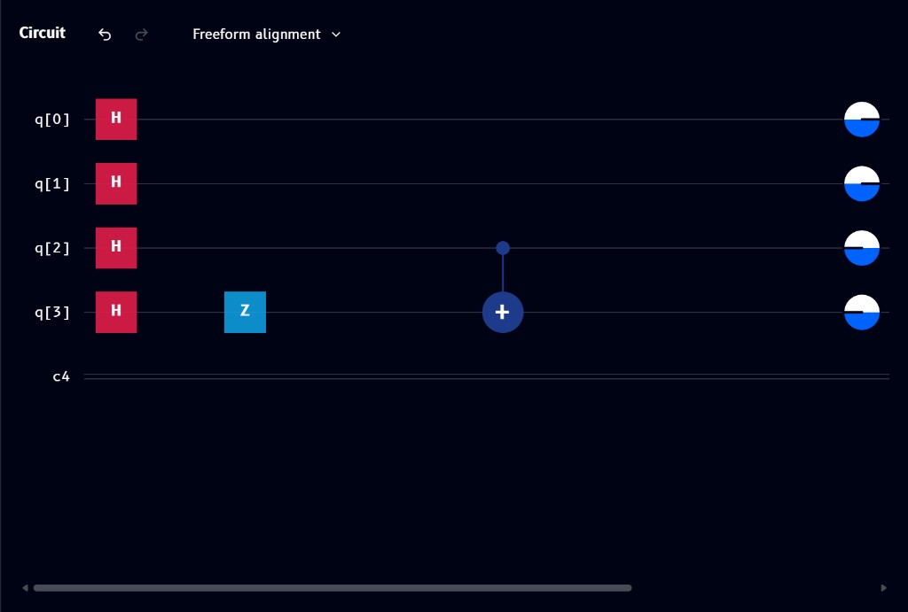

Gates keep their manually chosen horizontal positions instead of snapping left or into layer columns. This gives you full control over spacing and visual layout.

## Visualizations seed

Also found under the **Edit** menu, **Visualizations seed** controls the randomness used by the Q-Sphere and Statevector plots:

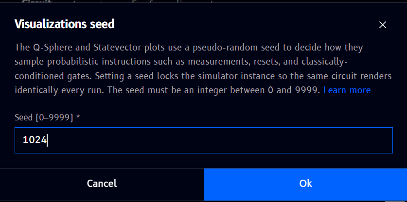

The Q-Sphere and Statevector visualizations use a pseudo-random seed to sample probabilistic instructions such as measurements, resets, and classically-conditioned gates. Setting a seed locks the simulator instance so the same circuit renders identically on every run.

- Enter an integer between **0 and 9999**
- Click **Ok** to apply, or **Cancel** to discard

## Selecting multiple operations

Drag a selection box around several gates (or shift-click each one) to select them together. A dashed bounding box appears around the selection, with its own toolbar:

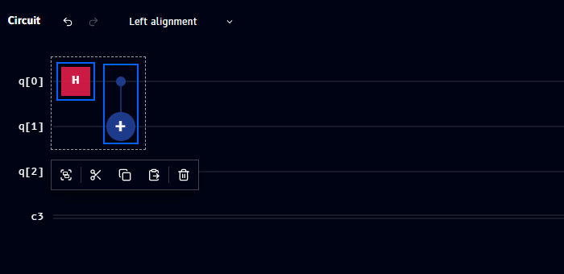

Unlike the single-gate toolbar, this one has no pencil (edit) or info icon - since those don't apply to a multi-gate selection. From left to right: **Group**, **Cut**, **Copy**, **Paste**, **Delete**.

## Grouping operations

Hovering the first icon in the multi-select toolbar confirms it's **Group**:

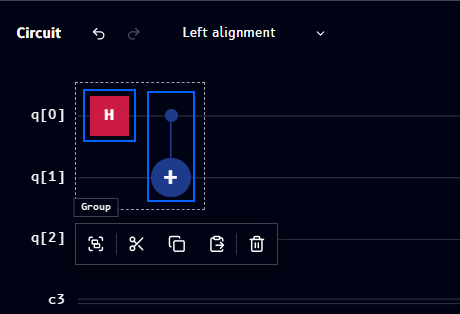

Clicking **Group** opens a dialog to turn the selection into a reusable **custom gate**:

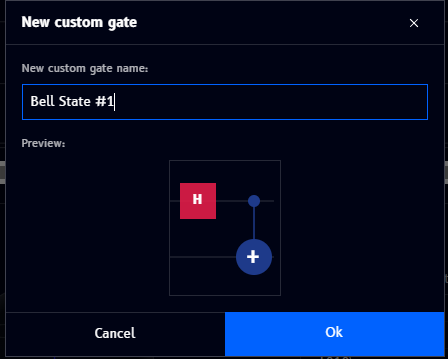

- Enter a **name** for the new gate (e.g. `Bell State #1`)
- The **Preview** shows the sub-circuit being grouped
- **Ok** creates the gate, **Cancel** discards it

Once created, the grouped gates collapse into a single labeled block on the circuit, with one pin per qubit it acts on (labeled `a`, `b`, ...):

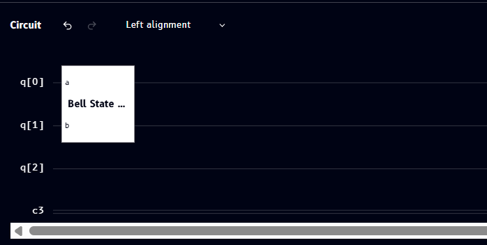

### Managing custom gates

Custom gates you create also appear in the [Operations](operations.md) catalog alongside the built-in gates, so you can drag them onto other circuits. Right-click (or use the equivalent menu) on a custom gate tile to manage it:

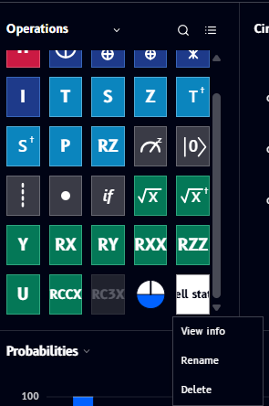

- **View info** - see details about the custom gate
- **Rename** - change its name
- **Delete** - remove it from the catalog

### How grouping appears in code

Grouping doesn't just change the diagram - it changes the generated code too, defining the group as a reusable gate/subroutine and then calling it. The same `H` + `CNOT` group shown above, across all four languages:

=== "OpenQASM"

    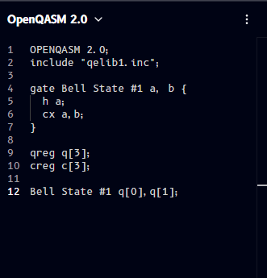

    ```qasm
    OPENQASM 2.0;
    include "qelib1.inc";

    gate Bell State #1 a, b {
      h a;
      cx a,b;
    }

    qreg q[3];
    creg c[3];

    Bell State #1 q[0],q[1];
    ```

=== "Qiskit"

    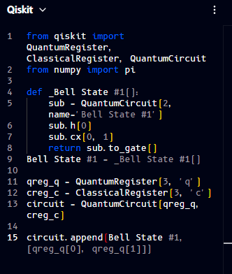

    ```python
    from qiskit import QuantumRegister, ClassicalRegister, QuantumCircuit
    from numpy import pi

    def _Bell State #1():
        sub = QuantumCircuit(2, name='Bell State #1')
        sub.h(0)
        sub.cx(0, 1)
        return sub.to_gate()
    Bell State #1 = _Bell State #1()

    qreg_q = QuantumRegister(3, 'q')
    creg_c = ClassicalRegister(3, 'c')
    circuit = QuantumCircuit(qreg_q, creg_c)

    circuit.append(Bell State #1, [qreg_q[0], qreg_q[1]])
    ```

=== "Cirq"

    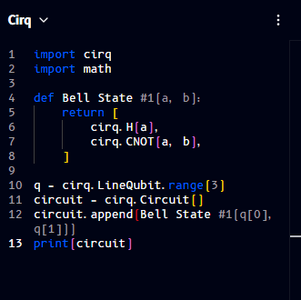

    ```python
    import cirq
    import math

    def Bell State #1(a, b):
        return [
            cirq.H(a),
            cirq.CNOT(a, b),
        ]

    q = cirq.LineQubit.range(3)
    circuit = cirq.Circuit()
    circuit.append(Bell State #1(q[0], q[1]))
    print(circuit)
    ```

=== "Q#"

    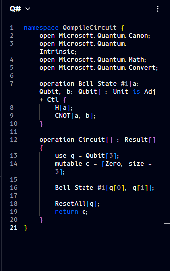

    ```qsharp
    namespace QompileCircuit {
        open Microsoft.Quantum.Canon;
        open Microsoft.Quantum.Intrinsic;
        open Microsoft.Quantum.Math;
        open Microsoft.Quantum.Convert;

        operation Bell State #1(a: Qubit, b: Qubit) : Unit is Adj + Ctl {
            H(a);
            CNOT(a, b);
        }

        operation Circuit() : Result[] {
            use q = Qubit[3];
            mutable c = [Zero, size = 3];

            Bell State #1(q[0], q[1]);

            ResetAll(q);
            return c;
        }
    }
    ```

!!! note
    The gate name used here (`Bell State #1`) contains a space and a `#`, which isn't valid as a literal identifier in real OpenQASM/Qiskit/Cirq/Q# code - Qompile displays the name as typed, but you'd need a code-safe name (e.g. `bell_state_1`) to actually run this code outside Qompile.

## Phase disks (in-circuit)

**Phase disks** are markers you manually insert at a chosen point on the circuit to snapshot each qubit's relative phase at that moment - distinct from the plain white circle that always sits at the very end of every wire (that's the default measurement/readout marker, see [Registers](#quantum-and-classical-registers) above).

To insert one, drag the [phase disk tool](../../gates/phase-disk-marker.md) from the Operations catalog and click the position on the circuit where you want the snapshot. A dashed vertical divider appears, with one disk per qubit wire showing that qubit's phase at that point, colored using the same **Phase** wheel used in the [Q-Sphere](../visualizations/q-sphere.md) and [Statevector](../visualizations/statevector.md) panels.

See [Phase disks](../visualizations/phase-disks.md) for a full explanation of what phase means, what the disk's color (and its plain white default) represents, and worked examples of inserting one on a Bell-state circuit, both before and after adding measurement gates.

## Undo/redo, cut/copy/paste/delete, clear circuit

These are available both from the gate action toolbar above and from the **Edit** menu - see [File / Edit / View dropdowns](../customizing.md#edit) for the full list and keyboard shortcuts.
