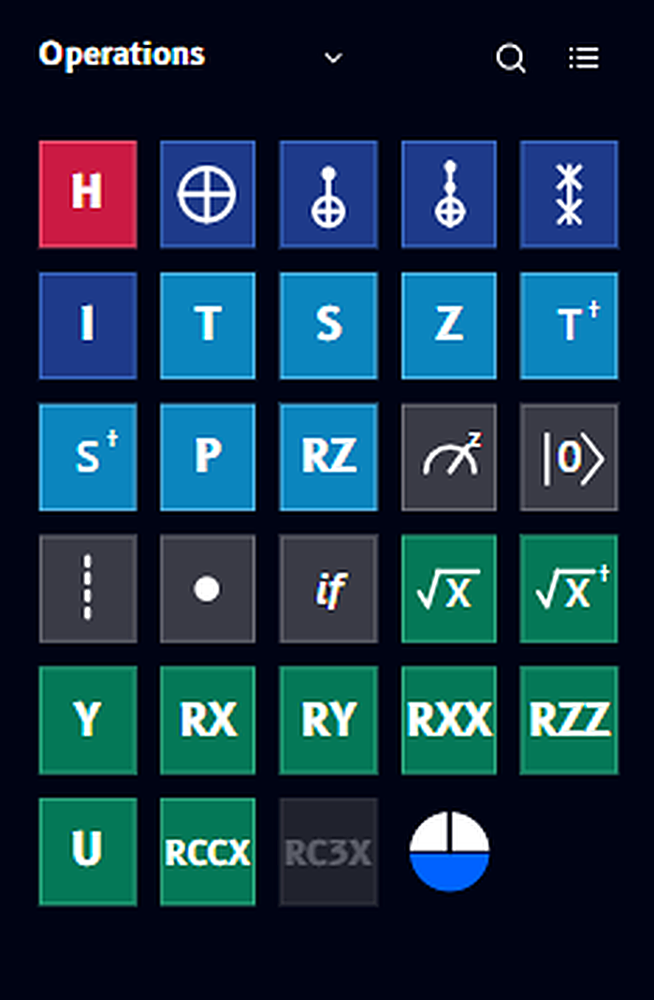
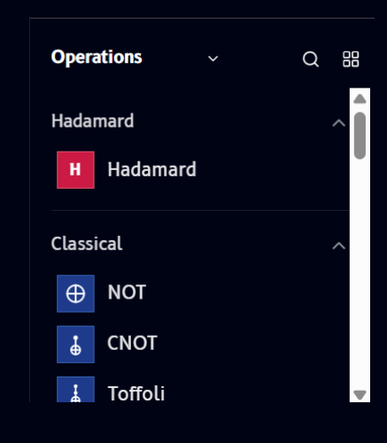
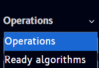

# Operations

The **Operations panel** is where you find every gate available in Qompile. It sits on the left side of the editor, and gates from here get dragged onto the [Circuit](circuit.md) canvas to build your program.

## Catalog view

By default, Operations opens in **catalog view** - a scrollable grid of gate icons, grouped by category and color-coded:

{ .doc-image--portrait }

The color of each tile reflects its category (e.g. Hadamard, Classical, and other gate families) - gates in the same family share a color, so you can spot related operations at a glance even before reading the label. The catalog includes single- and two-qubit gates, parameterized operations like `RZ`, `RXX`, `RZZ`, and `U`, and multi-qubit gates like `RCCX` and `RC3X`.

!!! note "Greyed-out gates"
    Some gates - like `RC3X` above - appear greyed out. This means the gate needs more qubits than your circuit currently has. Add more quantum registers to the circuit and the gate becomes available.

Want the details on any specific gate - its matrix, what it does to a qubit's state, and a minimal example? See the [Gate reference](../../gates/index.md).

## List view

Toggle the view icon (top right of the panel, next to search) to switch to **list view**, which shows gates grouped under expandable category headers with full names instead of just icons:

{ .doc-image--portrait }

Each category (e.g. **Hadamard**, **Classical**) can be collapsed or expanded using the chevron on the right. This view is useful when you know a gate's name but not its icon.

## Search

Click the search icon to filter the catalog by name. Typing a letter or gate name narrows the results instantly:

## Switching to Ready algorithms

The dropdown next to the **Operations** title switches the entire panel from the gate catalog to a list of [Ready algorithms](../../algorithms/overview.md) - prebuilt circuits like Bell states and Grover's algorithm that you can load directly:

---

Next: learn how to place these gates onto your circuit in [Circuit](circuit.md).
