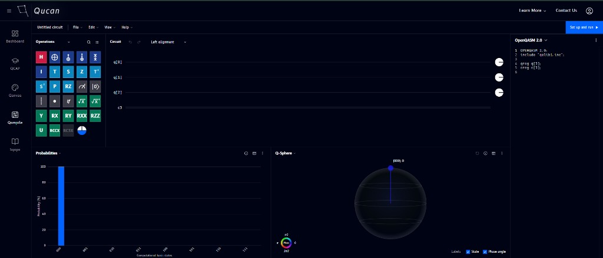

# Tour of Qompile

When you open Qompile, you land on the circuit editor. The interface is split into a few main regions:

| # | Region | What it's for |
|---|--------|----------------|
| 1 | **Top bar** | Circuit name, File / Edit / View / Help menus, and the **Set up and run** button |
| 2 | **Operations panel** (left) | The gate catalog - search and browse gates to drag onto your circuit |
| 3 | **Circuit canvas** (center) | Your quantum and classical registers, where you build the circuit |
| 4 | **Code panel** (right) | Live code view - see your circuit as OpenQASM, Qiskit, Cirq, or Q# as you build it |
| 5 | **Probabilities** (bottom left) | Bar chart of measurement outcome probabilities |
| 6 | **Q-Sphere** (bottom right) | 3D visualization of your circuit's quantum state |

The next sections walk through each of these in depth - starting with building a circuit by [dragging and dropping gates](drag-drop/operations.md).

!!! note
    Panels can be moved, resized, and closed - see [Managing windows](visualizations/windows.md) for details.
