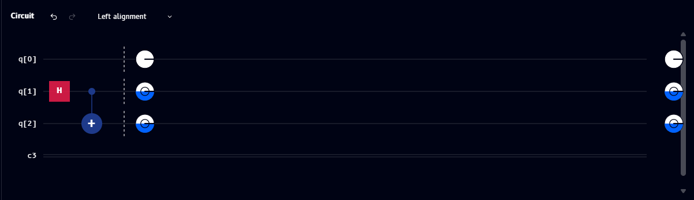
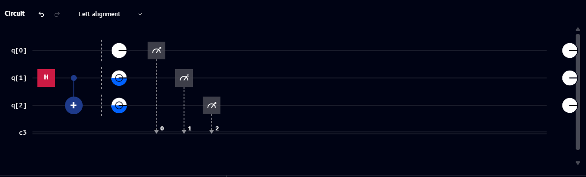

# Phase disks

**Phase disks** are Qompile's way of making an otherwise invisible property of a quantum state - its *phase* - visible directly on the circuit, without opening the [Q-Sphere](q-sphere.md) or [Statevector](statevector.md) panels. This page explains what phase actually is, then walks through a simple circuit to show exactly how it changes and how that shows up as color.

## What "phase" means

Every amplitude in a quantum state is a complex number, which has both a *magnitude* (how much of that outcome is present - this is what [Probabilities](probabilities.md) shows) and a *phase* (an angle, usually written \( \theta \), that doesn't affect probabilities by itself but affects how amplitudes combine when qubits interact).

Two kinds of phase matter, and it's important not to mix them up:

- **Global phase** - a phase applied equally to *every* amplitude in the whole state. This is never observable: \( |\psi\rangle \) and \( e^{i\alpha}|\psi\rangle \) behave identically in every measurement, no matter what \( \alpha \) is.
- **Relative phase** - a phase difference *between* amplitudes in a superposition. This absolutely is observable, through interference: it's what makes gates like [H](../../gates/hadamard.md) followed by another [H](../../gates/hadamard.md) able to cancel amplitudes out instead of just re-randomizing them.

Phase disks, the Q-Sphere, and the Statevector chart all display *relative* phase - colored so you can compare one amplitude's phase against another's at a glance.

## The Phase color wheel

Qompile uses one consistent color wheel for phase everywhere it appears - in [phase disks](#example-h-then-t-then-s), the [Q-Sphere](q-sphere.md), and the [Statevector](statevector.md) chart. It's a full color gradient running once around the circle as the phase angle runs from \( 0 \) to \( 2\pi \), with four evenly-spaced reference angles labeled on the legend: \( 0 \), \( \pi/2 \), \( \pi \), and \( 3\pi/2 \).

A disk (or bar, or point) that hasn't picked up any relative phase yet - phase exactly \( 0 \) - is shown **plain and uncolored (white)** rather than sitting at some arbitrary point on the wheel. As soon as a gate shifts that amplitude's phase away from \( 0 \), the disk fills in with the wheel's color for that angle: a small shift shows a faint tint, and a bigger shift (like a full \( \pi \)) shows a fully saturated color from the opposite side of the wheel. In other words, "white" is the visual baseline for *no relative phase yet*, and color is how much - and in which direction - that phase has moved since.

## Example: H, then T, then S

Here's the simplest possible demonstration, using three independent qubits so each phase value is easy to isolate. Each qubit starts at \( |0\rangle \) and gets a [Hadamard](../../gates/hadamard.md) to create a superposition, then a different phase gate:

| Qubit | Gates applied | Resulting state | Relative phase |
|---|---|---|---|
| `q[0]` | `H` | \( \tfrac{1}{\sqrt{2}}(|0\rangle + |1\rangle) \) | \( 0 \) |
| `q[1]` | `H`, [`T`](../../gates/t-gate.md) | \( \tfrac{1}{\sqrt{2}}(|0\rangle + e^{i\pi/4}|1\rangle) \) | \( \pi/4 \) |
| `q[2]` | `H`, [`S`](../../gates/s-gate.md) | \( \tfrac{1}{\sqrt{2}}(|0\rangle + e^{i\pi/2}|1\rangle) \) | \( \pi/2 \) |

All three qubits have **exactly the same measurement probabilities** - 50% `0`, 50% `1` - because [T](../../gates/t-gate.md) and [S](../../gates/s-gate.md) only ever touch phase, never magnitude. If you only looked at [Probabilities](probabilities.md), these three circuits would look identical. The difference only appears in phase-aware views:

- In the **[Statevector](statevector.md)** chart, all three `|1⟩` bars have the same height (≈0.707), but each is colored differently: `q[0]`'s bar sits at the wheel's reference color (phase 0), `q[1]`'s bar is rotated an eighth of the way around the wheel (phase π/4), and `q[2]`'s bar is rotated a quarter of the way around (phase π/2) - twice as far as `q[1]`'s, since S is twice the angle of T.
- The same pattern appears as three separate points in the **[Q-Sphere](q-sphere.md)**, and as three colored disks if you drop a **phase disk** marker after each qubit's gates, right on the circuit - see below.

This also demonstrates why T is sometimes called "√S": applying `T` twice in a row is the same phase shift as one `S` gate, since \( \pi/4 + \pi/4 = \pi/2 \).

## Inserting a phase disk on the circuit

Rather than switching to the Q-Sphere or Statevector panel, you can select the **phase disk** tool from the [Operations](../drag-drop/operations.md) catalog (see [Phase disk marker](../../gates/phase-disk-marker.md)) and click a point on the circuit. This inserts a dashed vertical divider with one small disk per qubit wire, colored using the same Phase wheel described above, showing each qubit's relative phase at that exact point in the circuit.

This is especially useful for entangled qubits, where there's no single "Statevector bar" to look at per qubit - the disk is a snapshot, not a live value, so it stays anchored to the point on the circuit where you dropped it even if you add more gates afterward.

A phase disk is **distinct from the plain white circle** that always sits at the very end of every wire (that's the default measurement/readout marker, see [Registers](../drag-drop/circuit.md#quantum-and-classical-registers)) - a phase disk only appears where you've explicitly placed one.

### Example: before adding measurement

Here's a Bell state (`H` + `CNOT`) with a phase-disk snapshot inserted right after the gates:

- `q[0]`'s disk is plain/white - phase 0
- `q[1]` and `q[2]` share a matching blue-filled disk - reflecting the relative phase they share as part of the entangled state

### Example: after adding measurement

Adding measurement gates *after* the phase-disk snapshot doesn't move or remove it - the disk still reflects the phase at its original position, before the measurements:

The measurement gates themselves route each qubit's result to a labeled classical bit (`0`, `1`, `2`), shown via the dotted lines down to `c3`. The plain white circles at the very right edge remain the default end-of-wire markers, unrelated to the phase disk snapshot.

## See also

- [Gate reference: S](../../gates/s-gate.md), [T](../../gates/t-gate.md), [P](../../gates/p-gate.md), [RZ](../../gates/rz-gate.md) - the gates that change relative phase
- [Q-Sphere](q-sphere.md) and [Statevector](statevector.md) - the other two places phase is shown
- [Phase disk marker](../../gates/phase-disk-marker.md) - the tool used to place a phase disk on the circuit
