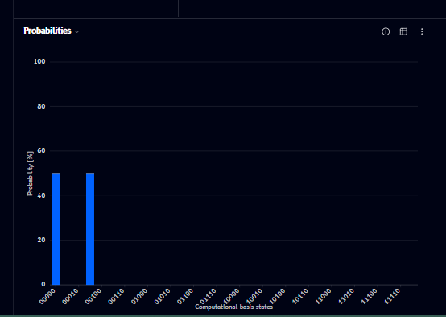
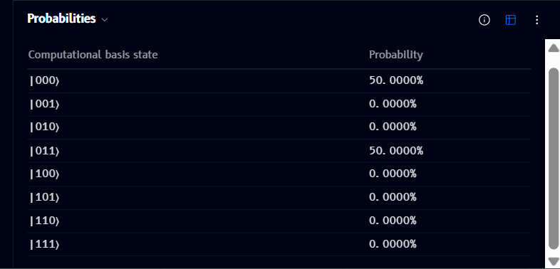
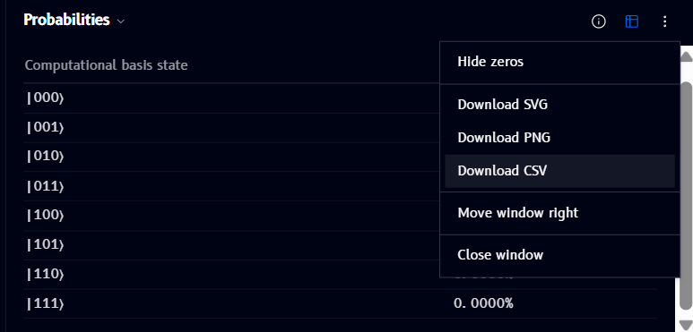

# Probabilities

The **Probabilities** panel shows a bar chart of the measurement outcome probabilities for your circuit - one bar per computational basis state:

- The **x-axis** lists computational basis states (e.g. `00000`, `00010`, `00100`, ...)
- The **y-axis** shows probability as a percentage
- Bars update live as you build your circuit

## Info

Click the **ⓘ** icon (top-right of the panel) to see an explanation of what the chart shows:

> Measurement probabilities |⟨x|ψ⟩|² for each computational basis state after running the circuit. Toggle the table icon to see exact values, or hide near-zero outcomes from the options menu.

## Table view

Click the table icon (top-right of the panel, next to info) to switch from the bar chart to an exact-value table, listing every basis state with its precise probability:

## Options menu

Click the **⋮** (more options) icon to open a menu with:

- **Hide zeros** - hide basis states with (near-)zero probability from the chart/table
- **Download SVG / Download PNG / Download CSV** - export the current chart or table
- **Move window right** / **Close window** - see [Managing windows](windows.md)
