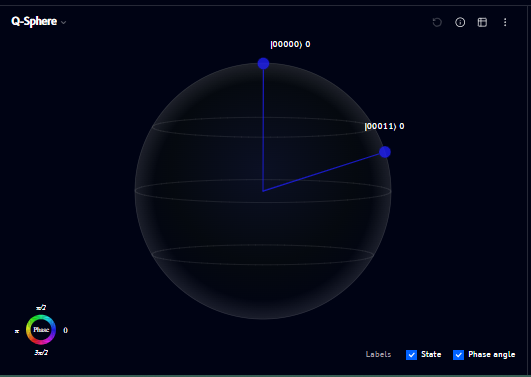
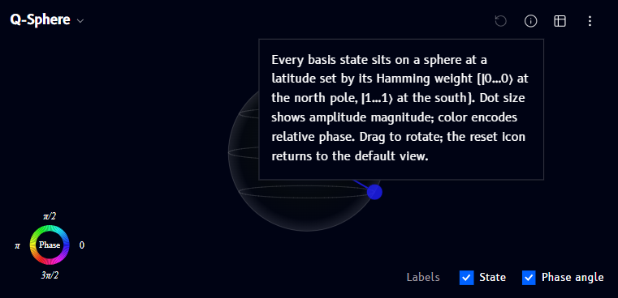
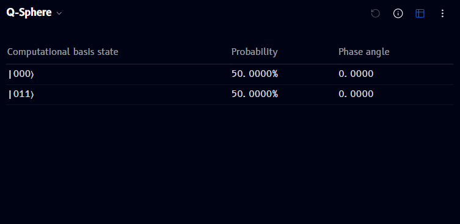
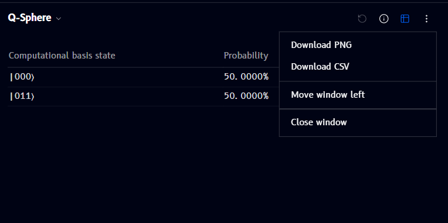

# Q-Sphere

The **Q-Sphere** panel renders your circuit's quantum state as points on a 3D sphere - one point per basis state with non-zero amplitude, positioned and colored to reflect its phase:

- Each labeled point (e.g. `|00000⟩`, `|00011⟩`) is a basis state present in the superposition
- The line from the center to each point represents that state's contribution
- The **Phase** color wheel (bottom left) maps color to phase angle (0, π/2, π, 3π/2)

## Info

Click the **ⓘ** icon (top-right of the panel) to see an explanation of what the sphere shows:

> Every basis state sits on a sphere at a latitude set by its Hamming weight (|0...0⟩ at the north pole, |1...1⟩ at the south). Dot size shows amplitude magnitude; color encodes relative phase. Drag to rotate; the reset icon returns to the default view.

## Phase info

The **Phase** color wheel legend (bottom-left of the panel) shows the color-to-angle mapping used for the points on the sphere - this is what the "color encodes relative phase" part of the info tooltip refers to.

## State and phase angle labels

Two checkboxes under **Labels** (bottom right) toggle what's shown next to each point:

- **State** - the basis state label (e.g. `|00011⟩`)
- **Phase angle** - the numeric phase angle for that state

## Return to initial position

The reset/rotate icon (top-right of the panel, leftmost in the icon group) returns the sphere to its default orientation after you've dragged to rotate it.

## Table view

Click the table icon (top-right of the panel) to switch from the 3D sphere to an exact-value table, listing each basis state's probability and phase angle:

## Options menu

Click the **⋮** (more options) icon to open a menu with:

- **Download PNG / Download CSV** - export the current view or table
- **Move window left** / **Close window** - see [Managing windows](windows.md)
