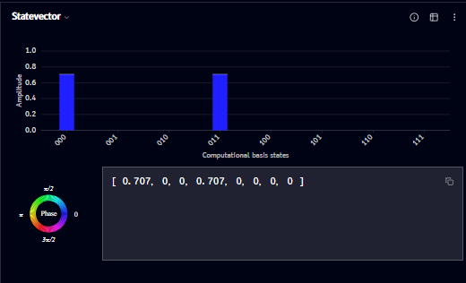
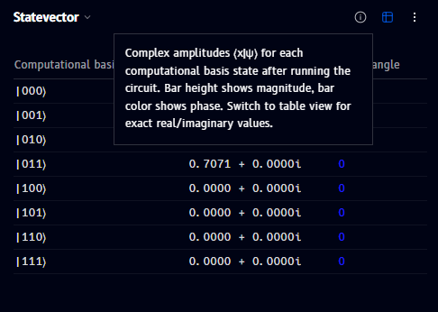
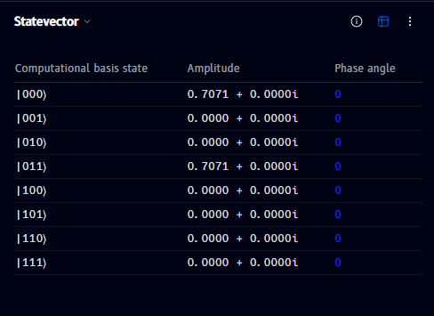
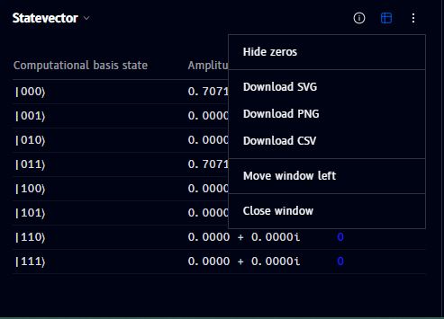

# Statevector

The **Statevector** panel shows your circuit's quantum state as both a bar chart of amplitudes and the raw statevector array:

- The **bar chart** plots amplitude magnitude against each computational basis state; bar color reflects phase
- Below the chart, the full **statevector** is printed as an array of amplitude values (e.g. `[0.707, 0, 0, 0.707, 0, ...]`), with a copy icon to copy it directly
- The small **Phase** color wheel (bottom left) shows the same phase-to-color mapping used in the [Q-Sphere](q-sphere.md)

## Info

Click the **ⓘ** icon (top-right of the panel) to see an explanation of what the chart shows:

> Complex amplitudes ⟨x|ψ⟩ for each computational basis state after running the circuit. Bar height shows magnitude, bar color shows phase. Switch to table view for exact real/imaginary values.

## Phase info

Bar color in the chart encodes phase, using the same **Phase** color wheel legend shown in the panel and in the [Q-Sphere](q-sphere.md).

## Vector info

The array below the chart is the exact statevector - each entry is one basis state's complex amplitude, in the same left-to-right order as the chart's basis states.

## Table view

Click the table icon (top-right of the panel, next to info) to switch to an exact-value table, showing each basis state's amplitude as a full complex number (real + imaginary) alongside its phase angle:

## Options menu

Click the **⋮** (more options) icon to open a menu with:

- **Hide zeros** - hide basis states with (near-)zero amplitude
- **Download SVG / Download PNG / Download CSV** - export the current chart or table
- **Move window left** / **Close window** - see [Managing windows](windows.md)
